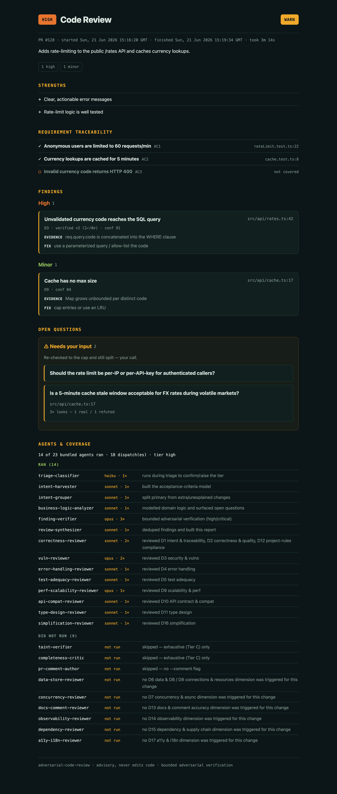

# Adversarial Code Review

A Claude Code **plugin** for advisory, **criticality-aware** code review. It understands a change's intent, scales review depth to risk (a typo gets a tiny review; an auth/payment/migration change gets adversarial depth), **adversarially verifies the findings it isn't sure about**, learns per project, and delivers results as Markdown, **HTML**, inline PR comments, or a pass/block gate.

**It never modifies your code — strictly advisory.**

> **New here?** [`docs/ARCHITECTURE.md`](docs/ARCHITECTURE.md) is a diagram-driven walkthrough of how a change flows through the plugin — built for readers who've never seen the code.

## What it does

- **Triages by risk** — deterministic, zero-cost tier selection (trivial → critical); cheap models classify, expensive models review only where the cost-of-miss is high.
- **Reviews the latest pushed code** — runs in a throwaway **git worktree** checked out from the remote's latest base/head, so it never reviews a stale local checkout; the worktree name is recorded in the report (`--no-worktree` to review the local tree instead).
- **Understands intent both ways** — builds acceptance criteria from the PR, **existing PR comments**, commits, and **ClickUp/Jira** tickets (fetched **via MCP — no API tokens**); derives what the code actually does; flags where the two diverge.
- **Groups changes by intent** — separates the primary intent from **extra/unexplained changes** and scrutinizes the extras (scope-creep control).
- **Reviews every dimension** — 17 dimensions (correctness, security, tests, concurrency, perf, DB/migrations, API-compat, types, deps/CVE, observability, a11y, …), each a dedicated bundled agent, dispatched only when the change warrants it.
- **Runs real tools** — `npm audit` / `pip-audit` feed the dependency dimension.
- **Bounded adversarial verification** (high/critical tiers) — findings it isn't sure about get an adversarial second (and at most third) look that tries to *refute* them, each from a **dimension-appropriate lens** (security→taint, concurrency→interleaving, …) rather than an identical re-read. Confirmed → kept; refuted → dropped; a **critical/important finding is not dropped on a single refuter** (when escalation is enabled and a 2nd look is affordable, a lone refutation → needs-human); a still-split result is surfaced to you, never silently dropped. Cap: **3 looks and 3 subagents per aspect**, decided in code via `route.mjs spawn`. (Lower tiers ship at the ≥80 confidence gate without a refutation pass — the cost trade-off.)
- **Exhaustive mode** (`--exhaustive`, auto at `critical`) — opt-in ultrareview-parity passes that trade tokens for fewer misses: a **completeness critic** (what dimension/criterion/taint did we miss?), **generative verify** (a verifier may surface an adjacent finding, not just refute), a **taint/data-flow** verifier for security findings, and **loop-until-dry** re-sweeps. Off by default so normal reviews stay cheap.
- **Scales to large diffs** — shards a big change into coherent review units; no nested-agent sprawl.
- **Remembers** — per-project memory suppresses accepted false-positives, tags recurring findings, and stores open questions so it doesn't re-ask.
- **Asks when unsure** — material business-logic ambiguities become questions for you (saved to memory), not silent assumptions.

## Requirements

| Tool | Required? | Used for |
|------|-----------|----------|
| **Node.js ≥ 18** (20+ recommended) | yes | the pure planning/render/verify scripts (zero npm deps) |
| **git** | yes | computing the diff |
| **a git remote** (e.g. `origin`) | optional | worktree review of the remote's latest base/head; without one it reviews the local checkout (`--no-worktree`) |
| **gh** (GitHub CLI) | optional | PR body + existing comments, and `--comment` (inline PR comments) |
| **ClickUp / Atlassian MCP** | optional | pull linked ticket context — **via MCP, no API tokens** |
| **npm / pip-audit** | optional | dependency/CVE scan (D15) |

`/review-init` runs a preflight that checks this and tells you what's missing.

## Install

Self-contained Claude Code plugin **and** a one-plugin marketplace. The repo *is* the
marketplace — add it by its GitHub slug, then install the plugin from it.

```text
/plugin marketplace add Tahmid12Khan/agentic-workflows     # GitHub slug (or a local path)
/plugin install adversarial-code-review@adversarial-code-review     # plugin@marketplace
```

Claude Code clones the repo, reads `.claude-plugin/marketplace.json` (which registers the
`adversarial-code-review` marketplace), and installs the bundled `adversarial-code-review`
plugin. The `/review-init` and `/review` commands are then available.

### Updating

Pull the latest version by refreshing the marketplace — this re-fetches the repo:

```text
/plugin marketplace update adversarial-code-review
```

The installed plugin then picks up the new version. If it doesn't, reinstall it (or manage
everything from the interactive `/plugin` menu):

```text
/plugin install adversarial-code-review@adversarial-code-review
```

## Quickstart

```text
/review-init     # check env + scaffold .adverserial-code-review/config.json
/review          # review the current branch vs its merge-base; writes review.md + review.html into .adverserial-code-review/review-<date>/review-<n>/
```

`/review` flags:

| Flag | Effect |
|------|--------|
| `--base <ref>` | Compare against `<ref>` instead of the auto-detected merge-base. |
| `--gate` | Exit non-zero on a `BLOCK` verdict (git hooks / CI). |
| `--comment` | Post confidence ≥ 80 findings as inline PR comments (needs `gh`). |
| `--tier <t>` | Force a tier (`trivial`…`critical`). |
| `--dimensions D2,D3` | Restrict to specific dimensions. |
| `--incremental` | Only re-spend effort on code new since the last review. |
| `--exhaustive` | Force the Tier C ultrareview-parity passes (completeness critic, taint, generative verify, loop-until-dry) at any tier. Costs more tokens; auto-on at `critical`. |
| `--no-worktree` | Review the local working tree instead of a worktree of the remote's latest base/head (use for **uncommitted** local changes). |

## The review output

Every run writes a self-contained report. Here is the HTML report for a `high`-tier PR review:



It opens with the tier + verdict, the PR number and start/finish timestamps, then the
requirement-traceability matrix (each row named, not just `AC1`), the findings grouped by
severity, the **Needs your input** questions, and an **Agents & coverage** rundown of
which agents ran (model + run count) and which did not and why.

### Where reviews are kept

Each run gets its own folder — an outer folder per day, an inner folder per run:

```
.adverserial-code-review/
  review-2026-06-21/                 # outer: the review date (YYYY-MM-DD)
    review-1-pr-128/                  # inner: run counter + PR number
      review.md                      # Markdown report
      review.html                    # same report, self-contained styled HTML
    review-2/                        # no open PR → the -pr-<n> suffix is omitted
      review.md
      review.html
```

The counter resets each day. The base folder (`.adverserial-code-review/`) also holds the
tracked `config.json`; the generated `review-*` folders, `learnings.json`, and
`last-review.json` are git-ignored.

### Format & how to access

- **`review.html`** — a single self-contained file (inline CSS, no assets). Open it in any
  browser: `open .adverserial-code-review/review-*/review-*/review.html` (macOS) or just
  double-click it. Best for reading.
- **`review.md`** — the same content as Markdown. Renders inline on GitHub/GitLab or in any
  editor; good for diffs, PR descriptions, and grepping.

Both files carry identical findings; pick whichever fits your workflow. The terminal also
prints the folder path, a one-line summary, and the verdict (`APPROVE` / `WARN` / `BLOCK`).

## How it works

```
INTAKE → CONTEXT → TRIAGE → INTENT → REVIEW (fan-out) → VERIFY (bounded) → SYNTHESIZE → DELIVER
preflight  gather    plan    harvest/    reviewers       adversarial        rollup       report/gate/
+worktree  +memory            group/biz   (per dim×shard)  refute (≤3)                    comments/notify
+scan
```

1. **Preflight + worktree** — verify node/git (gh, scanners optional); then, unless `--no-worktree`, `worktree.mjs` fetches the PR's base + head from the remote and checks out a throwaway git worktree at the **latest pushed** head — the review reads code and computes the diff there, then the worktree is removed (its name is recorded in the report).
2. **Context** — `gather.mjs` pulls PR body, **existing comments**, commits, and ClickUp/Jira **issue keys** (the tickets are then fetched **via MCP — no API tokens**); `memory.mjs` loads prior learnings; `scan.mjs` runs dependency CVE scans.
3. **Triage** (`plan.mjs` + `triage.mjs`) — diff → signals → tier, dimensions, per-dim model, **shards**, and the verification/escalation budgets. `triage-classifier` (haiku) can raise the tier on judgment.
4. **Intent** — `intent-harvester` (stated vs derived + mismatches), `intent-grouper` (primary vs extra intents), `business-logic-analyzer` (assumptions + open questions).
5. **Review** — `correctness-reviewer` always; the planned specialist agents per dimension; one pass per shard for large diffs; extra-intent groups get focused scrutiny.
6. **Verify** — `finding-verifier` adversarially tries to refute the unsure findings. **≤ 3 looks / ≤ 3 subagents per aspect.** Survivors kept, refuted dropped, still-split → "needs human".
7. **Synthesize** — `review-synthesizer` dedupes, builds the requirement→code matrix, separates findings from open questions, emits a verdict.
8. **Deliver** (`report.mjs`) — writes `review.md` + `review.html` into a per-run folder `.adverserial-code-review/review-<YYYY-MM-DD>/review-<n>[-pr-<num>]/` (each report carries the PR number and start/finish timestamps) + terminal summary; `--gate` → exit code; `--comment` → inline comments via `pr-comment-author` + `comments.mjs`; records this run to memory; surfaces open questions to you.

### Tiers (the token-saving brain)

| Tier | Example | Review |
|------|---------|--------|
| Trivial | typo, comment, doc | one quick inline pass, no subagents |
| Low | small localized logic w/ tests | one reviewer |
| Standard | normal feature/bugfix | correctness + screens + simplify |
| High | shared lib, API contract, perf hot path | full fan-out + bounded verify |
| Critical | auth, payments, migrations, concurrency, crypto | all dimensions, deepest models, bounded verify |

`risk_map` and `mandatory_checks` in `.adverserial-code-review/config.json` are **floors** triage cannot skip.

### Bounded adversarial verification

Runs on **high/critical tiers** (lower tiers ship at the ≥80 gate). The user-tunable contract: re-check **only the aspects a reviewer was unsure about** — never the whole review — and look at any one aspect **at most 3 times** (1 review + ≤ 2 verifier passes), with **at most 3 subagents** on it; the look-cap is hard-enforced in `verify.mjs` (verdicts are sliced to the budget) and the subagent-cap is decided in code by `route.mjs spawn` (the orchestrator threads the ledger and stops on `ok:false`). Each verifier attacks from a **dimension-appropriate lens** (`verify.mjs select` attaches it; security findings route to a `taint-verifier`). A verifier tries to *refute* the finding; majority rules; a **critical/important finding is not dropped on a single refuter** when escalation is enabled and a 2nd look is affordable (lone refutation → needs-human); any unresolved split is handed to you, not dropped. Configure under `verify` / `escalation`.

## Dimensions & agents

23 bundled agents. The four orchestration agents (`triage-classifier`, `intent-harvester`, `correctness-reviewer`, `review-synthesizer`) plus `intent-grouper`, `business-logic-analyzer`, `finding-verifier`, `pr-comment-author`, the two Tier C exhaustive-pass agents (`completeness-critic`, `taint-verifier`), and one specialist per dimension:

| Dim | Agent | Model |
|-----|-------|-------|
| D1/D2/D12 | correctness-reviewer | sonnet |
| D3 security | vuln-reviewer | opus |
| D4 error handling | error-handling-reviewer | sonnet |
| D5 tests | test-adequacy-reviewer | sonnet |
| D6/D8 data & resources | data-store-reviewer | sonnet · opus on migration |
| D7 concurrency | concurrency-reviewer | opus |
| D9 perf | perf-scalability-reviewer | opus |
| D10 API compat | api-compat-reviewer | sonnet |
| D11 types | type-design-reviewer | sonnet |
| D13 docs | docs-comment-reviewer | haiku |
| D14 observability | observability-reviewer | sonnet |
| D15 deps/CVE | dependency-reviewer | sonnet |
| D16 simplification | simplification-reviewer | sonnet |
| D17 a11y/i18n | a11y-i18n-reviewer | sonnet |

Each is isolated (clean packet: intent + criteria + diff, never the chat history), changed-lines-only, and confidence-gated (≥ 80).

## Configuration — `.adverserial-code-review/config.json`

Created by `/review-init`; schema at `.adverserial-code-review/config.schema.json`. Beyond `risk_map`, `mandatory_checks`, `project_rules`, `intent_sources`, and `gate`, v0.2 adds: `verify`, `escalation`, `large_diff`, `scan`, `learning`, `notify`, `worktree` (run the review in a throwaway git worktree checked out from the remote's latest base/head — so it reviews the most recent pushed code, not the local checkout; the worktree name is recorded in the report), and `trackers` (ClickUp/Jira — tickets fetched via MCP, **no API tokens**; if a tracker's MCP server isn't connected, `/review` asks you to enable it and the report states whether each tracker was used).

## Layout

```
commands/   /review, /review-init
agents/     23 bundled agents
lib/
  preflight.mjs   env check
  plan.mjs        diff → review plan (tier, dims, shards, budgets)
  triage.mjs      signals + config → plan (pure)
  signals.mjs     diff metadata → signals (pure)
  shard.mjs       large diff → review shards (pure)
  verify.mjs      bounded adversarial policy — select/resolve CLI + pure
  route.mjs       deterministic routing — extra-intent scrutiny, forced checks, aspect-budget ledger
  memory.mjs      per-project learnings store
  gather.mjs      PR / comments / trackers (keys) / rules → context bundle
  worktree.mjs    latest-code git worktree setup/teardown (fetch remote base/head)
  scan.mjs        npm/pip dependency CVE scan
  render.mjs      findings → review.md + review.html + verdict (pure)
  report.mjs      render + gate + memory record (CLI)
  comments.mjs    inline PR comments via gh (CLI)
.adverserial-code-review/    config.schema.json, config.json (dogfood)
tests/      node:test unit tests
fixtures/   sample diffs + expected tiers
```

## Design principles

- **Portable, zero-dependency** — pure ESM `.mjs`, only Node + git required.
- **Reviewer isolation** — each agent gets a clean packet, never the chat history. *(Enforced by the orchestrator command's packet construction, not a `lib/` backstop — agent-instructed.)*
- **False-positive control** — confidence ≥ 80; adversarial verify with per-dimension lenses (security/error/data/concurrency/resources/perf/api/types/observability; generic correctness fallback for the rest); accepted-FP memory.
- **Doubt is surfaced, not hidden** — unresolved findings (and lone refutations of high-severity findings) go to a "needs human" list.
- **Changed lines only** — pre-existing issues outside the diff are not flagged. *(Agent-instructed; no taint-following across the diff boundary.)*
- **Bounded cost** — model tiering + ≤ 3 looks/subagents per aspect.

## Development

```bash
npm test             # or: node --test
```

Runs the unit suite (triage, render, shard, verify, memory, scan, comments, gather, route, worktree) **and** the CLI integration suite (`tests/cli.test.mjs` — spawns plan/verify/scan/report/memory/route/comments/preflight end-to-end). No build, no dependencies.

## Roadmap

- **Done (v0.2)** — bounded adversarial verify (code-enforced via `verify.mjs select`/`resolve`), full 17-dimension catalog, HTML report, **git-worktree review of the remote's latest pushed code**, per-project memory, PR-comment ingestion, **MCP-based ClickUp/Jira ingestion (no API tokens)**, dependency CVE scan, large-diff sharding, intent grouping + deterministic extra-intent scrutiny & forced-check routing (`route.mjs`), aspect-budget ledger (≤3/aspect), business-logic open questions.
- **Next** — pre-push hook + GitHub Action templates; richer incremental diffing; auto-resolve memory questions from chat answers; deeper big-org parity (mutation testing, consumer-codebase impact scan, perf-benchmark execution, cross-shard dependency analysis).
- **Next** - Use context7 mcp or web search for up-to-date library docs

## License

MIT.
