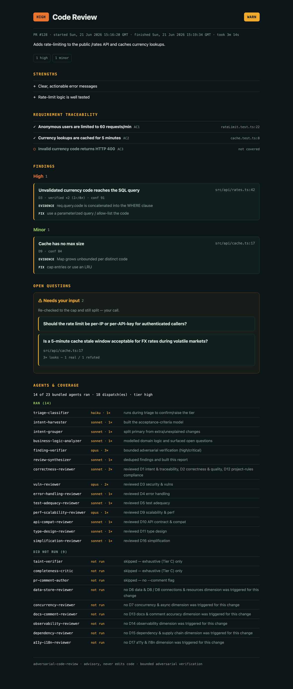

# Adversarial Code Review

A Claude Code **plugin** for advisory, **criticality-aware** code review. It understands a change's intent, scales review depth to risk (a typo gets a tiny review; an auth/payment/migration change gets adversarial depth), **adversarially verifies the findings it isn't sure about**, learns per project, and delivers results as Markdown, **HTML**, inline PR comments, or a pass/block gate.

**It never modifies your code — strictly advisory** — with exactly one opt-in exception: `/review-respond --fix` (see below), gated on a single explicit confirmation.

> **New here?** [`docs/ARCHITECTURE.md`](docs/ARCHITECTURE.md) is a diagram-driven walkthrough of how a change flows through the plugin — built for readers who've never seen the code.

## What it does

- **Triages by risk** — deterministic, zero-cost tier selection (trivial → critical); cheap models classify, expensive models review only where the cost-of-miss is high.
- **Reviews the latest pushed code** — fetches the remote's latest base/head and **detaches HEAD onto the head** for the review (restoring your branch afterward), so neither the diff nor the reviewers' own `Read`/`Grep` ever see a stale local checkout; the head/base reviewed is recorded in the report (`--no-checkout` to review the local tree in place; a dirty tree stops the run and asks you to stash/commit yourself). If the head is **behind its base**, it lists the missing commits and asks you to rebase/merge first (advisory — you can proceed) so the diff isn't computed against a stale base.
- **Understands intent both ways** — builds acceptance criteria from the PR, **existing PR comments**, commits, and **ClickUp/Jira** tickets (fetched **via MCP — no API tokens**); derives what the code actually does; flags where the two diverge.
- **Groups changes by intent** — separates the primary intent from **extra/unexplained changes** and scrutinizes the extras (scope-creep control).
- **Reviews every dimension** — 17 dimensions (correctness, security, tests, concurrency, perf, DB/migrations, API-compat, types, deps/CVE, observability, a11y, …), each a dedicated bundled agent, dispatched only when the change warrants it.
- **Reviews with doctrine + a change-size advisory** — on tier ≥ standard, reviewers are handed short advisory **doctrine fragments** (leverage-first severity norms, named structural remedies, complexity judgment, change-sizing) attached **by reference** — ≤ 2 per reviewer (correctness / simplification / type-design), none on trivial/low (no token cost) — so a review leads with the one structural problem over ten nits. Ported + rewritten from **addyosmani/agent-skills** (Google eng-practices lineage). A deterministic, zero-model **change-size advisory** (≥ 400 changed lines → "fine if it's one logical change"; ≥ 1000 → "should be split"; pure-deletion / mostly-rename changes exempt) rides along as its own advisory finding class — **never gate-affecting**.
- **Runs real tools** — `npm audit` / `pip-audit` feed the dependency dimension.
- **Batched, sonnet-first adversarial verify on non-trivial tiers** — on every tier where `plan.runVerify` is true, the **unsure** findings (low-confidence, flagged uncertain, or high-severity on a risk path — via `selectForVerification`) are **grouped by (verifier lens, file) into at most N batched verifier agents** (per tier: **3** low / **5** standard / **8** high & critical); one agent per group refutes all of its findings in a single pass, **reading only the group's per-file diff slices**, so the diff is paid once (and sliced) per group and agent count stops scaling with finding count. Confident, non-risk findings are trusted and ship at the ≥80 gate. Each group attacks from a **dimension-appropriate lens** (security→taint, concurrency→interleaving, …). **Cost lever — sonnet-first:** a first-pass group runs on the cheap model (`verify.model_first`, default `sonnet`); only a group holding a **critical** finding and the **taint** verifier go straight to `opus`. Then **one extra opus reverify guard** re-checks the refuted/uncertain **hot** findings for false negatives with the bias inverted (a wrongly-dropped real bug is the costly miss, so opus adjudicates every kill) — so **total verifier agents ≤ N+1**. Every selected finding is still verified: the cap bounds **agent count, never coverage**. Confirmed → kept; refuted → dropped; unresolved → surfaced to you, never silently dropped. Configurable: `verify.max_verifier_agents` (or `verify.by_tier.<tier>.max_verifier_agents`), `verify.model_first` (default `sonnet`) and `verify.verify_model` (default `opus`). (Trivial tier skips the verify pass — the cost trade-off.)
- **Optional fan-out trim on content-gated dimensions, off by default (`config.fanout`)** — with `fanout.trim: true`, the specialist dimensions a change's signals add **beyond** its tier's base set can be trimmed: advisory specialists (`fanout.defer_dims`, default perf `D9` + a11y `D17`) are deferred until `fanout.defer_below` (default `high`), and the remaining net-new specialists are capped at `fanout.max_added` (default uncapped), keeping the highest-priority ones (`fanout.keep_order`). **Cost lever — fan-out trim:** this attacks the **agent-count** axis (how many reviewer subagents fan out), alongside sonnet-first verify (model price) and per-file diff slicing (tokens/agent) — but unlike those two it **trades coverage for cost**: a deferred perf/a11y specialist genuinely won't run on a sub-high change (the always-on correctness reviewer still screens those areas), which is why it defaults off. Base-tier dimensions and `always_dims` are never trimmed, and a dropped dimension is always named in the report's **Did not run** section, never a silent cut. The **critical** tier is exempt from trimming altogether — it's the exhaustive tier, where full specialist coverage outweighs the cost saving.
- **Exhaustive mode** (`--exhaustive`, auto at `critical`) — opt-in ultrareview-parity passes that trade tokens for fewer misses: a **completeness critic** (what dimension/criterion did we miss?), a **taint/data-flow** verifier for security findings, and a **double run** of the correctness + vuln reviewers — two independent passes unioned + deduped by finding before verify, so a sample-to-sample miss is caught (real decorrelation, alongside the batched verify + reverify guard). Off by default so normal reviews stay cheap.
- **Cheap false-negative safety net** — near-zero-cost guards against silent misses: an **x1 completeness screen on every workflow tier** (low/standard/high — haiku, coverage-metadata only, no diff) flags dimension/criterion gaps and re-dispatches a per-tier-capped set of **sonnet** reviewers (**low 0** / **standard 1** / **high 2**; critical runs the fuller opus critic instead); a **cross-file consequence check** asks the correctness reviewer whether each in-repo caller of a changed export still holds; a deterministic **bug-history prior** (recent `fix`/`revert` commits touching the changed files, zero model cost) tells intent + correctness which files deserve extra scrutiny; and an opt-in **test-execution signal** (`--run-tests`) feeds real pass/fail to the test reviewer.
- **Scales to large diffs** — shards a big change into coherent review units; no nested-agent sprawl. A fan-out ceiling (`large_diff.max_review_aspects`, default 40) bounds the total reviewer count on many-dimension diffs so the agent count (and transient-overload exposure) stays capped without dropping any dimension.
- **Remembers** — per-project memory suppresses accepted false-positives, tags recurring findings, and stores open questions so it doesn't re-ask.
- **Learns from your 👍/👎** — `--comment` seeds both reactions on every posted finding for a one-click vote; a later review of the same PR harvests them (`node lib/feedback.mjs harvest --pr <n>`). A 👎 (with no 👍) turns into a suppressed false-positive, now also injected pre-generation into future reviewer packets (`args.knownFalsePositives` — "don't re-raise this exact finding"), not just dropped post-hoc. A 👍 alone is a no-op — read but not persisted, no verify-skip, no severity/confidence boost. Reply text rides along as context for the next reviewer packet. Degrades to a skipped note on any `gh` failure.
- **Converges on re-review** — a later run of the same PR classifies findings as resolved (auto-replies **"✅ Resolved in `<sha>`"** and resolves the GitHub thread, but only when the flagged code actually changed — otherwise "no longer reproduced"), persisting (never re-posted; reported as **"Still open (N)"**), or new. From round 2 on, minor/suggestion findings stop posting as comments (`rereview.nit_rounds`, Anthropic's REVIEW.md guidance) and a `report.max_posted_nits` cap (default 5) keeps even fresh nits from flooding a PR — the report file always lists everything.
- **Scales to your intent, not just the change's risk** — `--effort low|medium|high|max` tunes noise tolerance and verification depth for *this run*, orthogonal to the risk-driven tier; the confidence gate never loosens.
- **Takes review feedback like an author, not a stenographer** — `/review-respond` re-verifies every finding against the current code before agreeing, cites file:line for every disagreement (which feeds back into memory), and never performs agreement. Its opt-in `--fix` applies agreed findings one at a time with a test-run-and-revert safety net, behind a single confirmation — **the only code-mutating path in this plugin**.
- **Asks when unsure** — material business-logic ambiguities become questions for you (saved to memory), not silent assumptions.

## Requirements

| Tool | Required? | Used for |
|------|-----------|----------|
| **Node.js ≥ 18** (20+ recommended) | yes | the pure planning/render/verify scripts (zero npm deps) |
| **git** | yes | computing the diff |
| **a git remote** (e.g. `origin`) | optional | review of the remote's latest base/head (HEAD detached onto it, then restored); without one it reviews the local checkout (`--no-checkout`) |
| **gh** (GitHub CLI) | optional | PR body + existing comments; `--comment` (inline PR comments, batched into one review), the 👍/👎 feedback harvest, and re-review thread resolution |
| **ClickUp / Atlassian MCP** | optional | pull linked ticket context — **via MCP, no API tokens** |
| **npm / pip-audit** | optional | dependency/CVE scan (D15) |

`/review-init` runs a preflight that checks this and tells you what's missing.

## Install

Self-contained Claude Code plugin **and** a one-plugin marketplace. The repo *is* the
marketplace — add it by its GitHub slug, then install the plugin from it.

```text
/plugin marketplace add Tahmid12Khan/agentic-workflows     # GitHub slug (or a local path)
/plugin install adversarial-code-review@adversarial-code-review     # plugin@marketplace
```

Claude Code clones the repo, reads `.claude-plugin/marketplace.json` (which registers the
`adversarial-code-review` marketplace), and installs the bundled `adversarial-code-review`
plugin. The `/review-init` and `/review` commands are then available.

### Updating

Pull the latest version by refreshing the marketplace — this re-fetches the repo:

```text
/plugin marketplace update adversarial-code-review
```

The installed plugin then picks up the new version. If it doesn't, reinstall it (or manage
everything from the interactive `/plugin` menu):

```text
/plugin install adversarial-code-review@adversarial-code-review
```

## Quickstart

```text
/review-init     # check env + scaffold .adversarial-code-review/config.json
/review          # review the current branch vs its merge-base; writes review.md + review.html into .adversarial-code-review/review-<date>/review-<n>/
```

`/review` flags:

| Flag | Effect |
|------|--------|
| `--pr <n>` | Review PR `#n` directly — resolves its base/head with `gh pr view`, then fetches, detaches onto the head, and reviews the GitHub-exact fork-point range. Pass only this + the repo cwd; the plugin owns the rest (needs `gh`). |
| `--base <ref>` | Compare against `<ref>` instead of the auto-detected base. The reviewed range is always the fork point `merge-base(<ref>,head)..head` (GitHub three-dot) unless `checkout.fork_point:false`. |
| `--gate` | Exit non-zero on a `BLOCK` verdict (git hooks / CI). |
| `--comment` | Post confidence ≥ 80 findings as **one batched GitHub review** (falls back to individual comment posts only if the batch call fails) — a one-click GitHub `suggestion` block when a reviewer gave an exact fix, else a one-line fix description (needs `gh`). Seeds 👍/👎 on each posted comment for the feedback loop; on a re-review, resolves threads for findings that are actually fixed and skips re-posting ones still open. |
| `--effort <low\|medium\|high\|max>` | User-intent knob for *this run* — noise tolerance + verification depth — orthogonal to `--tier` (risk of the change). Default `medium` = today's behavior, byte-for-byte. `low`: report bar → confidence ≥ 90, one fewer verifier seat (floor 1), forces `fanout.trim` on. `high`: report bar → ≥ 60 (surfaces sub-gate findings in an "Uncertain (verify manually)" section instead of holding them back), verifier seats raised to the high-tier count regardless of the change's real tier. `max`: `high`'s thresholds + `--exhaustive` implied + fan-out trim off. **The gate never loosens** — it stays a fixed confidence ≥ 80 on every level; effort only moves the *report* bar and verifier caps. `--exhaustive` + `--effort low` legally combine (exhaustive wins on passes, low wins on the report threshold). |
| `--tier <t>` | Pin the tier (`trivial`…`critical`) **authoritatively** — `risk_map` cannot raise it and `--max-tier` cannot cap it. |
| `--max-tier <t>` | Ceiling on the **auto** tier only: the computed tier is clamped down to `<t>` (never raised, and ignored when `--tier` is set). For budget-capped batch callers. |
| `--dimensions D2,D3` | Restrict to specific dimensions. |
| `--incremental` | Narrow the review to only the commits added since the last review (`prevHead..head`) — but **only on a fast-forward**; a rebase/force-push (or missing state) falls open to the full `base..head`, so rewritten commits are never silently skipped. Off by default. |
| `--incremental-from <sha>` | Loop/CI-oriented: names the previously-reviewed head directly, for callers (the `pr-review-loop`) running in a throwaway worktree with no local `.adversarial-code-review/last-review.json` state to read. Falls back to that store when omitted. |
| `--full` | Force a complete `base..head` review (opt out of `--incremental`). |
| `--exhaustive` | Force the Tier C ultrareview-parity passes (completeness critic, D3 taint verifier, and a double run of the correctness + vuln reviewers) at any tier. Costs more tokens; auto-on at `critical`. |
| `--run-tests` | Run the configured `tests.command` (never guessed) after checkout and feed pass/fail + failing test **names** to the test-adequacy reviewer and the report header. **Executes repo code — never use on an untrusted PR.** Guarded: if the reviewed range itself modifies `config.json`'s `tests.command`, execution is skipped instead of run, closing an RCE path where an untrusted PR edits the test command and has it shell-executed. Off by default. |
| `--no-checkout` | Review the local working tree in place instead of detaching onto the remote's latest base/head (use for **uncommitted** local changes). |

## The review output

Every run writes a self-contained report. Here is the HTML report for a `high`-tier PR review:



It opens with a one-line **tally** right under the headline (`2 important, 3 minor, 1
pre-existing — WARN` — Anthropic's "summary shape" guidance: triage the whole review without
scrolling), then the tier + verdict, the PR number and start/finish timestamps, the
requirement-traceability matrix (each row named, not just `AC1`), the findings grouped by
severity, a **Pre-existing bugs** section (🟣 — bug-severity findings anchored *outside* the
change that verified real: real defects your change didn't introduce), an **Out-of-scope
observations** section for the rest anchored outside the changed lines, a **Process advisories**
section (the deterministic, zero-model change-size notes), an **Uncertain (verify manually)**
section on `--effort high`/`max` (sub-gate findings the run's effort chose to surface instead of
holding back), a **Still open (N)** section on a re-review (findings persisting from the last run
— never re-posted as comments; see [Re-review convergence](#re-review-convergence--thread-auto-resolution)
below), the **Needs your input** questions, and an **Agents & coverage** rundown of which agents
ran (model + run count) and which did not and why. Pre-existing bugs, out-of-scope observations,
process advisories, and the uncertain/still-open sections are all **advisory only — never gated or
commented**. Only findings on the changed lines drive the verdict/gate; and a `high`/`critical`
change that surfaces **zero** findings is reported as `WARN` ("verify manually"), never a silent
`APPROVE`.

### Where reviews are kept

Each run gets its own folder — an outer folder per day, an inner folder per run:

```
.adversarial-code-review/
  review-2026-06-21/                 # outer: the review date (YYYY-MM-DD)
    review-1-pr-128/                  # inner: run counter + PR number
      review.md                      # Markdown report
      review.html                    # same report, self-contained styled HTML
    review-2/                        # no open PR → the -pr-<n> suffix is omitted
      review.md
      review.html
```

The counter resets each day. The base folder (`.adversarial-code-review/`) also holds the
tracked `config.json`; the generated `review-*` folders, `learnings.json`, `last-review.json`,
and `posted-comments.json` (the `--comment` feedback-loop state) are git-ignored.

> **Directory renamed.** The state dir was `.adverserial-code-review/` (a typo) before this
> release. Every module that reads/writes it now prefers `.adversarial-code-review/` and falls
> back to the old name only when that's the *only* one present — a one-release migration window;
> `.gitignore` covers both names' generated state for now. Nothing to do on your end unless you'd
> scripted against the old path directly.

### Format & how to access

- **`review.html`** — a single self-contained file (inline CSS, no assets). Open it in any
  browser: `open .adversarial-code-review/review-*/review-*/review.html` (macOS) or just
  double-click it. Best for reading. Its top-left **usage panel** shows what this run cost —
  input tokens, cache reads, cache writes, output tokens, USD cost, an aggregate **cache-hit%**,
  and a **cost split by scope × model** (orchestrator vs the reviewer fan-out, per model family)
  so you can see what actually dominates spend — summed from this review's session transcripts
  (the orchestrator transcript plus the whole `subagents/` subtree, including Workflow reviewer
  transcripts nested under `subagents/workflows/wf_*/`) within the review window. Pricing is
  overridable via `usage.pricing` in config; set `usage.enabled: false` to hide it.
- **`review.md`** — the same content as Markdown, now including a **Cost** section mirroring the
  panel (total, cache-hit%, and the scope×model breakdown). Renders inline on GitHub/GitLab or in
  any editor; good for diffs, PR descriptions, and grepping.

Both files carry identical findings; pick whichever fits your workflow. The terminal also
prints the folder path, a one-line summary, and the verdict (`APPROVE` / `WARN` / `BLOCK`).

### Machine-readable verdict (CI)

Beyond the `--gate` exit code, every run emits a machine-readable severity tally so CI can gate
without parsing the report. `report.mjs` prints a final stdout line — the gate-affecting (in-diff,
confidence ≥ 80) finding counts by severity, the pre-existing-bug count, and the verdict — and
writes the same JSON as `verdict.json` in the run folder:

```text
acr-severity: {"critical":0,"important":2,"minor":1,"suggestion":3,"preExisting":1,"verdict":"WARN"}
```

Capture it either way:

```bash
# from the stdout line (report.mjs prints it last; /review relays it to the terminal)
node lib/report.mjs … | grep '^acr-severity:' | sed 's/^acr-severity: //' | jq .critical
# or read the run folder directly
jq .critical .adversarial-code-review/review-*/review-*/verdict.json
```

### Verdict vocabulary vs Anthropic `/code-review`

Teams running both tools: ACR keeps its own severity vocabulary (`critical`/`important`/`minor`/
`suggestion`) and gate verdicts (`APPROVE`/`WARN`/`BLOCK`) rather than adopting Anthropic's
`/code-review` tiers, but they map cleanly (`renderVerdict` in `lib/render.mjs`):

| ACR | Anthropic `/code-review` |
|-----|---------------------------|
| `critical` / `important` severity | Important-tier finding |
| `minor` / `suggestion` severity | Nit |
| **Pre-existing bugs** section | 🟣 Pre-existing |
| `BLOCK` | a gate-affecting finding at a `gate.block_on` severity (default `["critical"]`) |
| `WARN` | a gate-affecting finding at a `gate.warn_on` severity (default `["important"]`), or the high/critical-tier zero-finding floor (`floor: true` — "verify manually", never a silent clean bill) |
| `APPROVE` | nothing at `block_on`/`warn_on` severity survived — nits/suggestions only, or a clean review |

### Re-review convergence & thread auto-resolution

A later `--comment` run against the **same PR** classifies this run's findings against the last
one's (`lib/rereview.mjs`'s `diffFindings`, keyed on the line-insensitive `findingKey`):

- **Resolved** — reported last time, not this time, **and** the flagged code actually changed in
  `prevHead..head` (checked against a real diff, not just absence). Gets a reply — **"✅ Resolved in
  `<sha>`"** — and its GitHub thread is resolved (`gh api graphql`). If the finding vanished but the
  flagged code is *unchanged*, it's a model-variance non-reproduction, not a fix: replied "no longer
  reproduced", thread left open.
- **Persisting** — reported both times: never re-posted as a comment; the report lists it under
  **"Still open (N)"**.
- **New** — posted as usual, subject to two convergence levers: from round `rereview.nit_rounds + 1`
  on (default round 2; Anthropic's REVIEW.md "important-only after round 1" guidance), minor/
  suggestion findings stop posting as comments — report-only from there — and `report.max_posted_nits`
  (default 5) caps how many minor/suggestion findings post **at all**, top-N by confidence; the rest
  are noted ("+N similar nit(s) not posted") and still land in the report file.

The round counter and the prior findings' keys/severities/comment-ids live in `last-review.json`
(also the `--incremental` state file — see [How it works](#how-it-works)); a first review, a
different PR, or a rebased/force-pushed head all count as "not the same review lineage" and reset
to round 1 / treat everything as new.

## Responding to a review — `/review-respond`

The reviewer produces findings; `/review-respond` is the **author's** side of the conversation —
verify each one against the code as it stands *now* before agreeing, never perform agreement, and
push back with cited evidence when a finding is wrong (ported from superpowers'
`receiving-code-review` reception pattern). Read-only by default.

```text
/review-respond                    # classify the latest report's findings: agree / disagree / needs-human
/review-respond --report <path>    # classify a specific report folder instead of the latest one
/review-respond --fix              # ALSO apply agreed findings — see the warning below
```

For every finding, the `finding-responder` agent re-reads the actual file at `file:line` (not the
diff, not the reviewer's paraphrase — code may have already changed) and classifies it `agree`,
`disagree` (cites file:line evidence — this becomes a false-positive candidate in `learnings.json`,
the author-side half of the 👍/👎 feedback loop above), or `needs-human` (a genuine judgment call).
Forbidden: any performative opener ("You're absolutely right", "Great catch", bare "Thanks") —
these are stripped and flagged.

> **`--fix` is opt-in, off by default, and is the ONLY code-mutating path in this entire plugin.**
> It applies each `agree` finding **one at a time** as an exact, unique text replacement, runs the
> project's configured `tests.command` after every single edit, and **reverts that one edit** if
> tests regress — you never hand-revert. Nothing is written until you give **one explicit
> confirmation** after seeing the full list of findings it's about to apply. It refuses to run on a
> **dirty working tree** (an edit could mix with unrelated uncommitted changes) or a **detached
> HEAD** (a fix has to land on a real branch) — those checks only fire when `--fix` is actually
> requested; the read-only classification pass is unaffected by either.

## How it works

```
INTAKE → CONTEXT → TRIAGE → [Workflow: INTENT → REVIEW (fan-out) → VERIFY (batched) → SYNTHESIZE] → REPORT
preflight  gather    plan                harvest/    reviewers        ≤N sonnet-first groups     rollup       report.mjs
+checkout  +memory                       group/biz   (diff sliced)     + 1 opus reverify guard                /gate/comments
+scan
```

`/review` is a **thin dispatcher**: it runs the deterministic scripts (steps 1–3), then hands the fan-out to a Workflow (`lib/review-workflow.mjs`). The main agent never assembles report payloads by hand.

1. **Preflight + checkout** — verify node/git (gh, scanners optional); then, unless `--no-checkout`, `checkout.mjs` fetches the PR's base + head from the remote and **detaches HEAD onto the latest pushed head** — the review reads code and computes the diff there (so the reviewers' own `Read`/`Grep` see the real target), and your original branch is restored afterward (the head/base reviewed is recorded in the report). If the working tree is dirty git would overwrite, the run stops and asks you to stash/commit yourself. If the head is behind its base, it flags the missing commits and asks you to rebase/merge before reviewing.
2. **Context** — `gather.mjs` pulls PR body, **existing comments**, commits, and ClickUp/Jira **issue keys** (the tickets are then fetched **via MCP — no API tokens**); when `learning.enabled` and a prior `--comment` run left `posted-comments.json` for this PR, `feedback.mjs harvest` runs first so the 👍/👎 feedback loop is folded in before `memory.mjs` loads prior learnings; `scan.mjs` runs dependency CVE scans.
3. **Triage** (`plan.mjs` + `triage.mjs`) — diff → signals → tier, dimensions, per-dim model, **shards**, and the verification budget (per-tier `maxVerifierAgents` + `verifyModel`). (The `triage-classifier` judgment pass runs at the start of the Workflow — see below.)
4. **Workflow fan-out** (`lib/review-workflow.mjs`) — the Workflow owns intent → review → verify → synthesize, then returns the assembled report **payload** (it does not render — the sandbox can't write files):
   - **Intent** — `triage-classifier` (haiku, skipped on the trivial tier) first sanity-checks the tier (raises it for the human when blast radius warrants, and **adds dimensions the rules missed** as real review aspects); then a single `intent-analyzer` pass (the former `intent-harvester` + `business-logic-analyzer`, merged) builds the acceptance-criteria model (stated vs derived + mismatches), the primary-vs-extra intent grouping, **and** the domain/business-logic model (assumptions + open questions) — reasoning in **stages** (criteria/groups before assumptions/questions) so the merge keeps the old producer→consumer barrier. It **`Read`s the diff from `args.diffPath`**, told to ignore mechanically-generated churn (lockfiles, build artifacts, sourcemaps), plus the deterministic **bug-history prior** (`history.mjs`: recent `fix`/`revert` commits touching the changed files). Runs at **low+** so even low-tier reviewers get an intent brief.
   - **Review** — `correctness-reviewer` always; the planned specialist agents per dimension; one pass per shard for large diffs. **Args-by-reference + per-file slicing (cost lever):** `build-args.mjs` writes a per-file diff slice for each changed file, so each reviewer **`Read`s only its files' slices** (`diffReadFor`) instead of the whole diff, falling back to the full `args.diffPath` when a slice is missing (D3/security keeps the full diff for cross-file taint); it also gets a **compact intent brief** (criteria + mismatches + the groups flagged for scrutiny), and a **shared context pack** (`context-pack.mjs`, built once in step 3: the enclosing definitions of changed code, import blocks, in-repo callers of changed exports, a **hop-2 section** — each caller's own enclosing definition SIGNATURE only, one contract level up, capped at 8 per file — and, for changed TS/Python files, a **type-boundary section** (the interface/dataclass definitions referenced on the changed lines, headed `## for: D10,D11` so `api-compat-reviewer`/`type-design-reviewer` know it's for them) — passed by path in `args.contextPackPath`, `Read` first; hop-2 and the type-boundary are the first extras dropped under the pack's byte caps, so the mandatory enclosing-definition body is never truncated) — the shared blocks lead the prompt so they **prompt-cache across every aspect of the same reviewer** (caching is **intra-agent only** — distinct agents have distinct system prompts, so nothing caches across the intent/review/verify boundary; the report's **cache-hit% panel** shows the real per-run rate). Reviewers **use the pack first** and make at most ~4 extra Read/Grep calls, only when it's insufficient for a specific suspected finding (no `Bash`). D3/security is the exception: it runs as a **single unsharded pass over the full diff** (so cross-file taint survives, instead of re-paying the whole diff once per shard). Extra-intent groups get focused scrutiny. Per-reviewer extras ride the packet: the **correctness reviewer** gets a **cross-file consequence** directive (does each listed caller still hold?) plus the **bug-history prior**; the **test-adequacy reviewer** gets the **executed-test signal** when `--run-tests` ran.
   - **Verify (batched, sonnet-first)** — on non-trivial tiers (`plan.runVerify` true), the **unsure** findings — low-confidence, flagged uncertain, or high-severity on a risk path (`selectForVerification`) — are **grouped by (verifier lens, file) into ≤ `maxVerifierAgents` groups** (per tier: 3/5/8) and refuted a group at a time: one `finding-verifier` (or `taint-verifier` for D3 security) per group returns a verdict for every finding it holds — each **`Read`s only the group's per-file diff slices** (`diffReadFor`; the `taint-verifier` keeps the full diff so cross-file taint survives). **Cost lever — sonnet-first:** a first-pass group runs on the cheap model (`verify.model_first`, default `sonnet`); only a group holding a **critical** finding and the taint verifier go straight to `opus`. Confident, non-risk findings are trusted and ship at the ≥80 gate. Then **one extra opus reverify guard** re-examines the refuted/uncertain hot findings for false negatives (bias inverted — uphold unless the refutation clearly holds, so opus adjudicates every kill), so **total verifier agents ≤ N+1**. Every selected finding is verified — the cap bounds agent count, not coverage; an unresolved finding → "needs human". On **every workflow tier** (low/standard/high) a cheap **x1 completeness screen** (haiku, coverage-metadata only — no diff, so dimension/criterion gaps, not taint) reuses `completeness-critic` and re-dispatches a per-tier-capped set of **sonnet** reviewers (**low 0** / **standard 1** / **high 2**). On **exhaustive** reviews (critical/`--exhaustive`) the full `completeness-critic` (opus, with the diff) instead hunts for what was **missed** (unrun dimension, uncovered criterion, untraced taint) and re-dispatches ≤ 6 targeted reviewers. Either way the new findings re-enter the batched Verify.
   - **Synthesize** — `review-synthesizer` dedupes, builds the requirement→code matrix, separates findings from open questions, emits a verdict.
5. **Deliver** — the main agent runs `report.mjs` directly on the returned payload (no executor agent), writing `review.md` + `review.html` into a per-run folder `.adversarial-code-review/review-<YYYY-MM-DD>/review-<n>[-pr-<num>]/` + a terminal summary opening with the one-line **tally** (`renderReport`'s `tallyLine`). The report **always** includes an "Agents & coverage" section listing which agents ran and which did not (and why); `report.mjs` takes no `--out`/`--html` flags. `--comment` runs *before* `report.mjs` overwrites `last-review.json`, so it still sees the prior run's state to classify resolved/persisting/new and posts the survivors as **one batched GitHub review** (falling back to individual posts only if the batch call fails); then `report.mjs` relays `folderPath` + verdict + `notes`; `--gate` → exit code; records this run to memory (+ the round counter); surfaces open questions to you.

### Tiers (the token-saving brain)

| Tier | Example | Review |
|------|---------|--------|
| Trivial | typo, comment, doc | one quick inline pass, no subagents |
| Low | small localized logic w/ tests | one reviewer + x1 haiku completeness screen (0 gap re-dispatch) |
| Standard | normal feature/bugfix | correctness + screens + x1 haiku completeness screen (≤1 gap) |
| High | shared lib, API contract, perf hot path | full fan-out + simplify + bounded verify + x1 haiku completeness screen (≤2 gaps) |
| Critical | auth, payments, migrations, concurrency, crypto | all dimensions, deepest models, bounded verify |

`risk_map` and `mandatory_checks` in `.adversarial-code-review/config.json` are **floors** triage cannot skip. A low/standard-tier change also gets a cheap **blast-radius escalation**: `fanin_threshold` (default 20) counts distinct in-repo files outside the diff that import a changed file (`git grep` over `signals.mjs`'s `moduleSpecifiers`, capped to the first 10 changed files) and bumps the tier one level when the count is at or above it — `0` disables it. `review_instructions` (default `REVIEW.md`) is a **mandate**: its content is injected verbatim as the highest-priority block leading the reviewers, intent-analyzer, and completeness-critic — review-specific guidance that outranks the general `project_rules` conventions.

### Bounded adversarial verification

Runs on **every non-trivial tier** (`plan.runVerify`), with findings shipping at the ≥80 gate by default. The contract: re-check **only the findings a reviewer was unsure about** — never the whole review — and do it in **at most N+1 agents per run**. The selected (unsure) findings are **grouped by (verifier lens, file) into ≤ N batched verifier agents** — one **opus** agent per group refutes every finding it holds in a single pass (the diff is paid once per group), and **N is a per-tier budget** (`maxVerifierAgents`, default **3** low / **5** standard / **8** high & critical). Every selected finding lands in exactly one group, so the cap bounds **agent count, never coverage**. Then a single **+1 opus reverify guard** re-examines the refuted/uncertain **hot** findings for false negatives (bias inverted — uphold unless the refutation clearly holds on the changed lines), because a wrongly-dropped real bug is the costly miss. Each group attacks from a **dimension-appropriate lens** (`verify.mjs select` attaches it; security findings route to a `taint-verifier` that keeps the full diff for cross-file source→sink). A verifier tries to *refute*; confirmed → kept, refuted → dropped, any unresolved split → handed to you, not dropped. Configure under `verify`: `max_verifier_agents` (or `by_tier.<tier>.max_verifier_agents`), `verify_model` (default `opus`). The confidence bar is **80/80 on every tier by default** (worst-case rigor is never lowered for you); a project can spend a **per-tier verify budget** via `verify.by_tier.<tier>` — trust findings at a lower confidence on a lower-risk tier to select fewer for verification. `reverify_below` is clamped up to `report_confidence` per tier, so a per-tier relaxation lowers both together and never opens a dead band.

## Dimensions & agents

20 bundled agents. The four orchestration agents (`triage-classifier`, `intent-analyzer`, `correctness-reviewer`, `review-synthesizer`) plus `finding-verifier`, the two Tier C exhaustive-pass agents (`completeness-critic`, `taint-verifier`), and one specialist per dimension:

| Dim | Agent | Model |
|-----|-------|-------|
| D1/D2/D12 | correctness-reviewer | sonnet |
| D3 security | vuln-reviewer | opus at high/critical · sonnet below |
| D4 error handling | error-handling-reviewer | sonnet |
| D5 tests | test-adequacy-reviewer | sonnet |
| D6/D8 data & resources | data-store-reviewer | sonnet · opus on migration |
| D7 concurrency | concurrency-reviewer | opus at high/critical · sonnet below |
| D9 perf | perf-scalability-reviewer | opus at high/critical · sonnet below |
| D10 API compat | api-compat-reviewer | sonnet |
| D11 types | type-design-reviewer | sonnet |
| D13 docs | docs-comment-reviewer | haiku |
| D14 observability | observability-reviewer | sonnet |
| D15 deps/CVE | dependency-reviewer | sonnet |
| D16 simplification | simplification-reviewer | sonnet · high+ only (opt-in below via `always_dims`/`--dimensions`) |
| D17 a11y/i18n | a11y-i18n-reviewer | sonnet |

Each is isolated (clean packet: intent + criteria + diff, never the chat history), changed-lines-only, and confidence-gated (≥ 80).

## Configuration — `.adversarial-code-review/config.json`

Created by `/review-init`; schema at `.adversarial-code-review/config.schema.json`. Beyond `risk_map`, `mandatory_checks`, `project_rules` (paths to general repo conventions, surfaced as context), `review_instructions` (path to a review-specific mandate — default `REVIEW.md` — whose **content** leads the reviewers/intent/critic prompts at highest priority; capped at 8k, disabled by dropping the key or the file), `intent_sources`, and `gate` (its **`block_on`** severity list — default `["critical"]` — is tunable to `["critical","important"]` to block on important findings too, now honored by both the `--gate` exit code **and** the rendered markdown/HTML verdict), v0.2 adds: `always_dims` (dimensions reviewed on every run regardless of tier — e.g. `D16`), `models` (per-dimension model matrix — `opus_dims`, `opus_min_tier`, `by_tier`), `verify` (the batched-verify policy — `max_verifier_agents` and `by_tier.<tier>.max_verifier_agents` per-tier agent budget, `verify_model` default `opus`, plus the `reverify_below`/`report_confidence` bars), `fanout` (the agent-count cost lever, off by default — `fanout.trim` to enable; defers `fanout.defer_dims` (default `D9`/`D17`) below `fanout.defer_below` (default `high`), and caps net-new content-gated specialists at `fanout.max_added` (default uncapped), ranked by `fanout.keep_order`), `large_diff`, `scan`, `learning`, `notify`, `checkout` (detach HEAD onto the remote's latest base/head for the review and restore it afterward — so it reviews the most recent pushed code, not the local checkout; the head/base reviewed is recorded in the report), `trackers` (ClickUp/Jira — tickets fetched via MCP, **no API tokens**; if a tracker's MCP server isn't connected, `/review` asks you to enable it and the report states whether each tracker was used), `usage` (the cost panel — `usage.enabled` to toggle it, `usage.pricing` to override the per-model-family price table), `tests` (`tests.command` + `tests.timeout_ms` — the test command `--run-tests` and `/review-respond --fix` run; never guessed), and `completeness` (`completeness.screen_on_high` — toggle the cheap high-tier completeness screen, default on). Also: `feedback` (the 👍/👎 loop — `feedback.store`, default `posted-comments.json`, gated by `learning.enabled`), `rereview` (`rereview.nit_rounds`, default 1 — re-review rounds before minor/suggestion findings go report-only), and `report` (`report.max_posted_nits`, default 5 — the nit-posting cap; the report file itself always lists every finding regardless).

## Layout

```
commands/   /review, /review-init, /review-respond
agents/     21 bundled agents (20 for /review + finding-responder for /review-respond)
  doctrine/   review-doctrine fragments (severity-norms, structural-remedies, complexity-judgment, change-sizing)
lib/
  preflight.mjs   env check
  plan.mjs        diff → review plan (tier, dims, shards, budgets, effort)
  triage.mjs      signals + config → plan (pure); applyEffort (report/verify thresholds+caps only)
  signals.mjs     diff metadata → signals (pure); change-size (process) advisory
  doctrine.mjs    reviewer agent → review-doctrine fragments per tier (pure)
  shard.mjs       large diff → review shards (pure)
  verify.mjs      bounded adversarial policy — select/resolve CLI + pure
  route.mjs       deterministic routing — extra-intent scrutiny, forced checks, aspect-budget ledger
  memory.mjs      per-project learnings store (v2) + last-review.json (v2: round/commentId)
  rereview.mjs    re-review convergence — diffFindings/classifyVanished/nextRound/nitConvergence (pure)
  feedback.mjs    👍/👎 PR-reaction harvest → memory feedback (CLI + pure)
  respond.mjs     /review-respond: parse review.md, validate stances, scope guard, --fix apply + revert (CLI + pure)
  gather.mjs      PR / comments / trackers (keys) / rules → context bundle
  build-args.mjs  pre-step outputs (plan/bundle/diff/context/routing/doctrine) → Workflow args, file→file (diff + pack never enter agent context)
  context-pack.mjs shared context pack — enclosing defs, imports, in-repo callers, hop-2 signatures, type boundaries (CLI + pure)
  history.mjs     bug-history prior — recent fix/revert commits per changed file (CLI + pure)
  test-signal.mjs --run-tests: run the configured test command → pass/fail + failing names (CLI + pure)
  checkout.mjs    latest-code review: fetch remote base/head, detach HEAD onto head, restore after
  scan.mjs        npm/pip dependency CVE scan
  render.mjs      findings → review.md + review.html + verdict + tally line (pure)
  usage.mjs       this run's token usage + USD cost from the session transcripts (CLI + lib)
  report.mjs      render + gate + memory record + verdict.json (CLI)
  review-workflow.mjs     Workflow DSL — fan-out (intent/review/verify/synthesize); returns the report payload
  review-orchestration.mjs  pure helpers for the Workflow (canonical + unit-tested)
  trim-diff.mjs   scope a diff to a reviewer's shard files (pure, canonical for the inlined copy)
  comments.mjs    inline PR comments via gh — batched review, feedback seeding, re-review reply/resolve (CLI)
.adversarial-code-review/    config.schema.json, config.json (dogfood)
evals/      seeded-bug fixtures + scorer — the regression gate for reviewer-prompt/doctrine changes
tests/      node:test unit tests
fixtures/   sample diffs + expected tiers
```

## Design principles

- **Portable, zero-dependency** — pure ESM `.mjs`, only Node + git required.
- **Reviewer isolation** — each agent gets a clean packet, never the chat history. *(Enforced by the orchestrator command's packet construction, not a `lib/` backstop — agent-instructed.)*
- **False-positive control** — confidence ≥ 80; adversarial verify with per-dimension lenses (security/error/data/concurrency/resources/perf/api/types/observability; generic correctness fallback for the rest); accepted-FP memory.
- **Doubt is surfaced, not hidden** — unresolved findings (and lone refutations of high-severity findings) go to a "needs human" list.
- **Changed lines only** — pre-existing issues outside the diff are not flagged. *(Agent-instructed; no taint-following across the diff boundary.)*
- **Bounded cost** — model tiering + a per-tier verifier-agent budget (≤ N+1 batched verifier agents per run).

## Limits

What this plugin deliberately does **not** do — so you know where to keep other gates:

- **No dynamic analysis** beyond the opt-in `--run-tests` pass (it runs the configured `tests.command`, nothing else). No fuzzing, profiling, coverage measurement, or sanitizers.
- **No design/architecture judgment beyond the diff.** Reviewers reason about the changed lines plus the context pack (enclosing definitions, imports, in-repo callers); they do not evaluate whole-system design, module boundaries, or whether the feature should exist.
- **No cross-repo contract analysis.** It cannot see consumers in other repositories. For the multi-consumer / breaking-change problem, keep dedicated CI contract gates — e.g. [oasdiff](https://github.com/oasdiff/oasdiff) or [buf](https://buf.build) for API/proto compatibility, [Pact](https://pact.io) for consumer-driven contracts.
- **No debate between reviewers.** Each dimension reviewer runs in isolation; verification is adversarial refutation of findings (batched by lens+file), not a multi-agent argument. Exhaustive mode adds a second independent reviewer pass (double run), not a debate.
- **Advisory only, with one confirmed exception.** `/review` never edits, commits, or applies a fix — every finding's `fix`/`fixCode` is rendered as a suggestion for you (or a one-click GitHub `suggestion` block) to accept. `/review-respond --fix` is the sole opt-in, off-by-default, single-confirmation exception (see [above](#responding-to-a-review--review-respond)); it never runs unless you pass `--fix` and then explicitly confirm.

## Development

```bash
npm test             # or: node --test
```

Runs the unit suite (triage, render, shard, verify, memory, scan, comments, gather, route, checkout, context-pack, history, test-signal, doctrine, feedback, rereview, respond, evals) **and** the CLI integration suite (`tests/cli.test.mjs` — spawns plan/verify/scan/report/memory/route/comments/preflight/context-pack/history/test-signal end-to-end). No build, no dependencies.

```bash
node evals/run.mjs                      # deterministic layers only (plan/capture-diff), model-gated cases marked skipped
ACR_EVAL_LIVE=1 node evals/run.mjs      # + a live single-prompt review pass per case (needs `claude` CLI + credentials)
```

`evals/` measures review *quality* (recall/precision against 11 fixture cases — 9 seeded-bug + 2 clean-only, plus verify-pass value — FPs the verifier killed vs. real findings it wrongly dropped), as opposed to `tests/`, which only checks the pipeline doesn't crash. It's the regression gate for any reviewer-prompt or `agents/doctrine/` change: compare `aggregate.meanRecall` between a before/after scoreboard (`evals/results/<label>.json`) and treat a drop as a quality regression, not a style nit. See `evals/README.md`.

## Releases & roadmap

- Shipped work, version by version: **[RELEASES.md](RELEASES.md)**.
- What's planned next: **[ROADMAP.md](ROADMAP.md)**.

## License

MIT.
