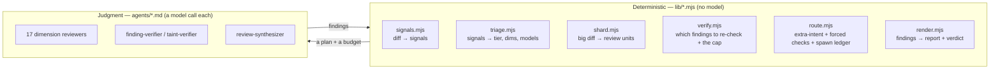
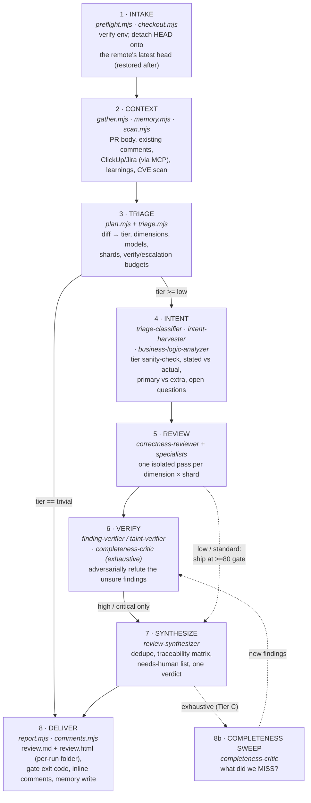
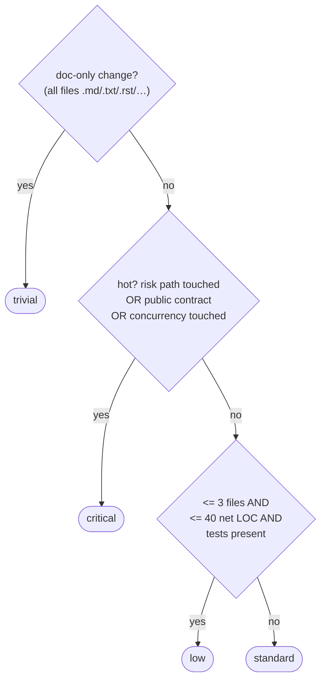
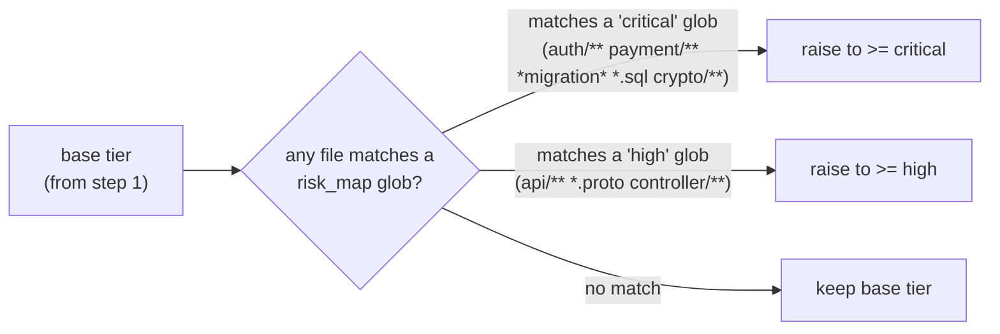
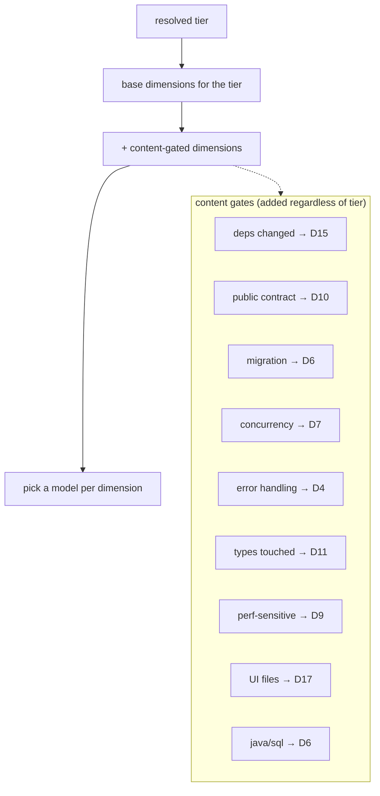
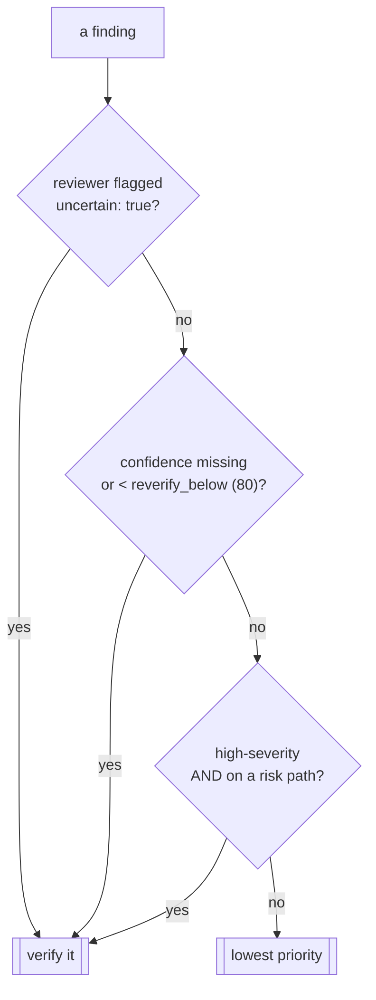
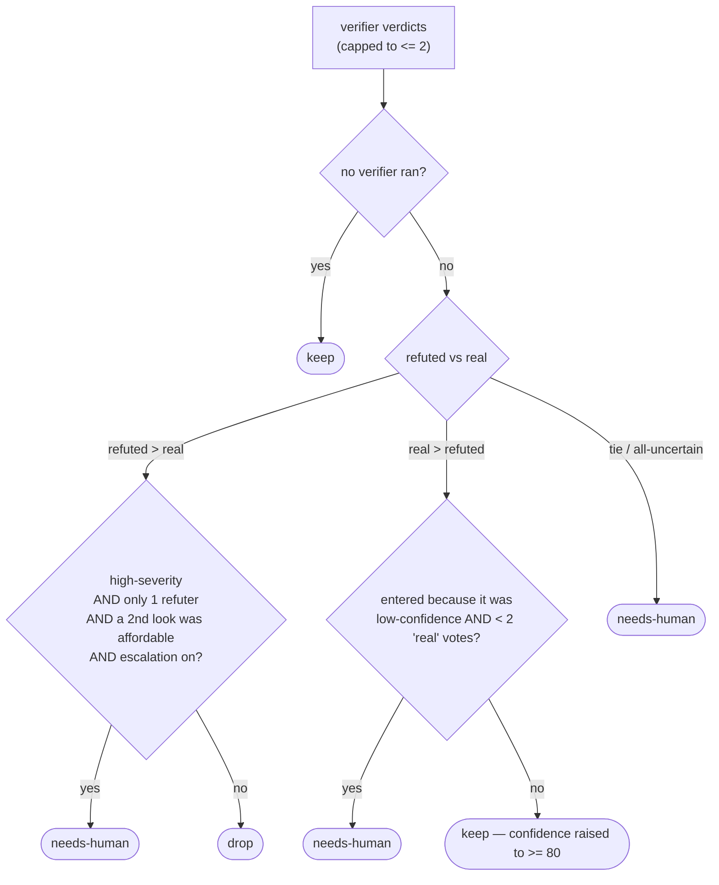
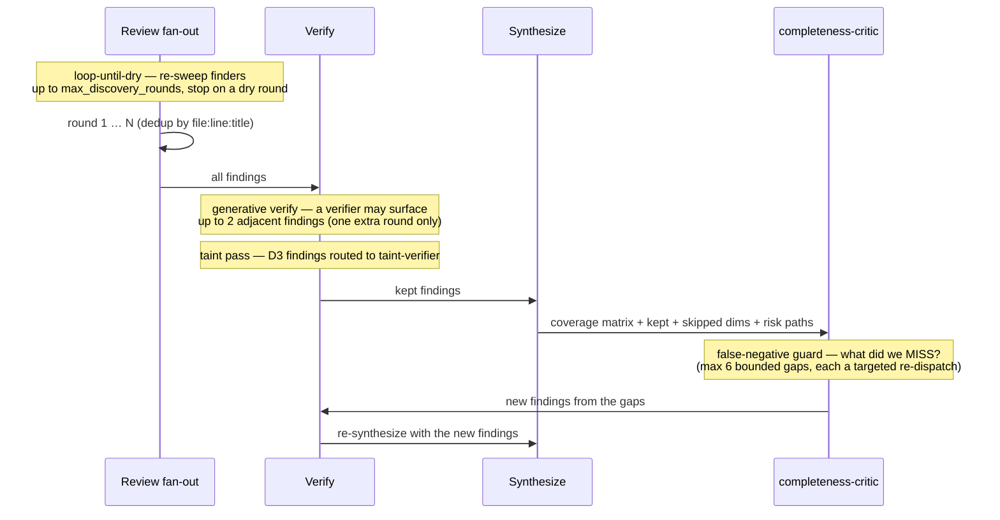

# Adversarial Code Review — How it works

A field guide to the plugin's internals, written for someone who has never seen the
code before. It explains **what the plugin does**, **how a change flows through it**,
and **where every decision is actually made** — with diagrams you can follow without
reading a line of source.

> **One-sentence summary:** it reads a diff, measures how dangerous the change is,
> reviews only the dimensions that matter at a depth that matches the risk,
> adversarially re-checks the unsure findings with their own verifier on non-trivial tiers (bounded to 3 looks),
> and reports the result — **it never edits your code.**

- New here? Start at [Mental model](#mental-model).
- Want the install steps? See the [README](../README.md#install).
- Want to know *why a tier was chosen*? Jump to [The triage brain](#the-triage-brain).

---

## Mental model

Two kinds of work happen inside the plugin, and keeping them separate is the whole design:

| | **Deterministic scripts** (`lib/*.mjs`) | **Subagents** (`agents/*.md`) |
|---|---|---|
| Do | the cheap, repeatable, *decidable* work | the judgment calls |
| Examples | diffing, signal extraction, tier selection, sharding, the verify policy, rendering, memory | reading code for bugs, deciding if a finding is real |
| Cost | ~free (pure Node, no LLM) | a model call — spent only where earned |
| Property | same input → same output, unit-tested | isolated, advisory, confidence-gated |

The scripts decide **what to do and how much to spend**; the models do the part that
genuinely needs a model. No model call decides a tier — a model only sanity-checks the
tier a script computed. This is what keeps a typo cheap and an auth change thorough.

---

## The pipeline — intake to verdict

Every review runs the same eight stages. Stages 1–3 are run by the main agent (`commands/review.md`) as deterministic scripts; stages 4–8 run inside the Workflow (`lib/review-workflow.mjs`) dispatched in step 4. A trivial change exits after stage 3.

What each stage contributes:

1. **Intake** — `preflight.mjs` checks Node + git are present (and notes whether `gh` and the CVE scanners are available). Hard-fails fast so you don't waste a review on a broken environment. Then, unless disabled, `checkout.mjs` fetches the PR's base + head from the remote and **detaches HEAD onto the latest pushed head** — the rest of the review reads code and computes the diff there, so it never reviews a stale local checkout. The head/base is recorded in the report, and your original branch is restored afterwards. A dirty working tree stops the run with a stash-and-rerun message (it never stashes for you).
2. **Context** — `gather.mjs` pulls the PR body, **existing PR/inline comments**, ClickUp/Jira issue keys (whose tickets the orchestrator then fetches via MCP — no API tokens), and project rules into one bundle; `memory.mjs` loads prior learnings (recurring findings, accepted false-positives, open questions); `scan.mjs` runs `npm audit` / `pip-audit` when available to seed the dependency dimension. Missing tools degrade gracefully and are noted in the report.
3. **Triage** — the brain. See [The triage brain](#the-triage-brain).
4. **Intent** — the Workflow opens with `triage-classifier` (haiku, skipped on the trivial tier where dimensions are fixed), a judgment pass on the deterministic tier: it can flag a **higher** tier for the human (it can't safely re-plan mid-run) and **adds dimensions the rules missed**, which become real review aspects. Then it builds the acceptance-criteria model: what the change *says* it does (PR/comments/tickets) vs. what the code *actually* does, and where the two diverge. Splits the primary intent from **extra / unexplained** changes and flags the extras for scope-creep control. Material business-logic ambiguities become *questions for you*, not silent assumptions. The intent agents see the diff with **mechanically-generated noise stripped** (lockfiles, build artifacts, sourcemaps, snapshots — `stripNoise` in `lib/trim-diff.mjs`, the same `NOISE` set the plan already drops from `files`); they reason about what changed, not vendored churn, and a dependency bump still reaches D15 via the `depsChanged` signal.
5. **Review** — fans out reviewers inside the Workflow. The always-on `correctness-reviewer` plus one specialist per planned dimension, each on the model `triage` chose for that dimension, each on its own shard for large diffs. Every reviewer gets a **clean packet** (intent + criteria + diff) and never the chat history. On a sharded review the diff is **scoped to the reviewer's shard files** (`lib/trim-diff.mjs`) to cut the dominant input-token cost — except D3/security, which always sees the full diff so cross-file taint source→sink survives; reviewers can Read/Grep for any sibling context the scoped diff omits.
6. **Verify (the unsure findings)** — the Workflow spawns a **separate verification agent for each unsure finding** — low-confidence, flagged uncertain, or high-severity on a risk path (`selectForVerification`) — on tiers where `plan.runVerify` is true; confident, non-risk findings are trusted and ship at the ≥80 gate. Each verifier attacks from a dimension-appropriate lens on a diff **scoped to the finding's own file** (`verifierDiff`, the same `lib/trim-diff.mjs` trim the reviewers use) — except the D3 `taint-verifier`, which keeps the full diff so cross-file source→sink survives — and **escalates cheap→strong** (`sonnet` first, `opus` on an uncertain/hot-refuted verdict; `critical` straight to `opus`); the ≤ 3 subagents/aspect cap is enforced in code. See [Bounded adversarial verification](#bounded-adversarial-verification). On **exhaustive** reviews (`plan.discovery.completenessCritic`, auto at `critical`) a `completeness-critic` then hunts for what the fan-out **missed** — an unrun dimension, an uncovered criterion, an untraced input→sink — and re-dispatches up to 6 targeted reviewers whose new findings (deduped against the existing set) all re-enter Verify before synthesis.
7. **Synthesize** — `review-synthesizer` dedupes, builds the requirement→code traceability matrix, separates confident findings from open questions, and emits one verdict — a one-sentence headline plus a short bulleted `summaryPoints` list (the report renders bullets, not a wall paragraph).
8. **Deliver** — the Workflow returns the assembled report **payload**; the `/review` command then runs `report.mjs` **directly via node** (no executor agent — the Workflow sandbox can't write files, and broadcasting the whole payload to a model that only shells out is pure input-token waste). `report.mjs` writes `review.md` + `review.html` into a per-run folder `.adverserial-code-review/review-<YYYY-MM-DD>/review-<n>[-pr-<num>]/` (an outer folder per day, an inner folder per run; each report names the PR and its start/finish times). It exposes `generateReport()` as a function that degrades soft failures (memory, file write) to notes and never crashes the run; only a missing-plan/agentRuns contract violation or a `--gate` BLOCK exits non-zero. The report **always** includes an "Agents & coverage" section (Ran / Did not run). `review.html` also carries a top-left **usage panel** — `report.mjs` calls `lib/usage.mjs` (`computeReviewUsage`) to sum this run's token usage + USD cost from the session transcripts (the orchestrator's `<session>.jsonl` plus every `<session>/subagents/agent-*.jsonl`) within the review's time window (`payload.startedAt` → now); best-effort, degrades to a note and no panel when transcripts aren't reachable. `report.mjs` accepts no `--out`/`--html` flags; the per-run folder is always written. Terminal summary + gate exit code (with `--gate`); `--comment` posts inline PR comments via `comments.mjs`; the run is recorded to memory; unresolved questions are surfaced to you.

---

## Reviewing the latest pushed code (the checkout)

A review is only as good as the code it reads. Reviewing your **local** checkout can mean
reviewing a stale branch — or missing a fix that only exists on the remote. So, unless turned
off, the pipeline detaches HEAD onto the **remote's latest** head before reviewing. This also
means the reviewer subagents' own `Read`/`Grep` (which run in the main repo, not in any sandbox)
see the real target code, not whatever branch you happened to have checked out.

`lib/checkout.mjs` (a deterministic CLI) does this on `setup`:

1. **Fetch** the PR's base + head from the remote (`git fetch --no-tags <remote> <base> <head>`).
2. **Record** the current ref to restore afterward — the branch name, or (already detached) the sha.
3. **Detach** HEAD onto `<remote>/<head>` (`git checkout --detach <remote>/<head>`). If the working tree has changes git would overwrite, it prints a **stash-and-rerun** message and exits non-zero — it **never stashes for you** (could silently lose work, and the plugin is advisory).
4. **Return** the resolved `baseRef`/`headRef`, the head `sha`, the `originalRef` to restore, the diff `range` (`baseRef..HEAD`), and `behindBase` — the commits the base has that the head has **not** integrated.

Because the diff is two-dot `git diff <base>..HEAD`, moving HEAD onto the latest head is exactly
what makes the whole downstream pipeline (`plan.mjs`, `gather.mjs`, the reviewers) operate on the
most recent pushed code — no separate working directory is involved.

When `behindBase.count > 0` the head is behind its base: the two-dot `base..head` diff is then computed against a base the branch hasn't merged, so it can miss real conflicts and renders base's newer commits as phantom deletions. `/review` lists those commits and asks the user to rebase or merge the base in before re-running. It is **advisory** — the user can proceed anyway; the review never hard-blocks on this.

The **head/base reviewed is recorded in the report** (under *Context used*). After the report is
written, `/review` runs `checkout.mjs restore --ref <originalRef>` to put the user back on their
original branch — and warns if the restore fails (so they aren't stranded on a detached HEAD).

It is **best-effort** on fetch: if the fetch fails (offline / no remote) it notes the skip and
falls back to whatever ref resolves locally. Set `checkout.enabled: false` or pass `--no-checkout`
to review the local working tree **in place** — required when reviewing **uncommitted** changes,
since a checkout only sees committed refs. Config: `checkout` → `{ enabled, remote }`.

---

## The triage brain

Triage is **pure, dependency-free logic** (`lib/triage.mjs`, fed by `lib/signals.mjs`).
No model decides the tier. It runs in three steps: compute a base tier from the diff's
signals, **raise** it if a configured risk path is touched, then add content-gated
dimensions on top.

### Step 1 — base tier from signals

Risk paths are matched by `signals.mjs` against filename patterns: `auth`, `payment`,
`migration` / `*.sql`, `crypto`, `infra` (Dockerfile, `*.tf`, k8s/helm), and `secrets`.

### Step 2 — the `risk_map` floor (can only *raise*)

Your `.adverserial-code-review/config.json` defines glob → tier floors. A glob hit raises the tier to its
floor; it can **never** lower a change below the risk its path implies.

A forced `--tier <t>` sets a floor too — `risk_map` can still raise above it, and the
whole plan (dimensions, models, verify) is recomputed from the result, so an override is
a real depth change, not a relabel.

### Step 3 — dimensions, then models

Each tier ships a base set of dimensions; content signals add more on top.

**Base dimensions per tier** (from `TIER_DIMENSIONS` in `triage.mjs`):

| Tier | Base dimensions |
|------|-----------------|
| trivial | D2, D13 |
| low | D1, D2, D5, D16 |
| standard | D1, D2, D4, D5, D12, D16 |
| high | D1, D2, D4, D5, D10, D11, D12, D16 |
| critical | D1, D2, D3, D4, D5, D6, D7, D8, D12, D14 |

**Model tiering** — `opus` is reserved for the three hardest dimensions (D3 security,
D7 concurrency, D9 perf) and for a migration (D6 → opus whenever the `migration` risk
path is detected); everything else runs on the tier's model (`haiku` at trivial,
otherwise `sonnet`). The adversarial verifier runs on `opus`.

---

## The tier ladder

Five rungs. Each adds reviewers and depth over the one below. Most diffs land low, so most
reviews stay cheap — and the verification pass only kicks in from **High** up.

| Tier | Example change | What runs | Verify? |
|------|----------------|-----------|---------|
| **Trivial** | typo, comment, doc-only | one quick inline pass — no subagents | no |
| **Low** | small localized logic, with tests | a single reviewer | no |
| **Standard** | a normal feature or bugfix | correctness + screens + simplify | no |
| **High** | shared lib, API contract, hot path | full fan-out + bounded verify | **yes** |
| **Critical** | auth, payments, migrations, crypto, concurrency | all dimensions, deepest models, verify + exhaustive | **yes** |

`risk_map` and `mandatory_checks` in the config are **floors** triage cannot skip.

---

## Bounded adversarial verification

The plugin doesn't trust its own first pass — but it doesn't re-run the whole review
either. On every non-trivial tier (`plan.runVerify` true) the Workflow refutes the
**unsure findings** — each with its **own separate verifier agent** — and looks at any one
aspect **at most three times total** (1 review + ≤ 2 verifier passes), with **at most
3 subagents** on it. Both caps are enforced in code (`verify.mjs` slices verdicts to the
budget; the per-aspect spawn ledger in `lib/review-workflow.mjs` — `canSpawn`/`recordSpawn`,
canonically `lib/review-orchestration.mjs` — must clear before every dispatch).

### Which findings get a second look (`selectForVerification`)

`selectForVerification` is the live gate: a confident, non-risk finding is trusted and
ships at the ≥80 gate without spending a verifier; the unsure ones — uncertain,
low-confidence, or high-severity-on-a-risk-path — are the ones refuted. The report makes this
visible per finding — `verified ×N (✓/✗)` when a verifier actually looked (`verify.passes > 1`)
versus `trusted` when it shipped on confidence alone — so an absent "verified" tag reads as a
deliberate skip, not a missing check. The pure helper is
canonical + unit-tested in `lib/verify.mjs` and inlined into the Workflow:

### The adversarial lens

A second look is not "re-read the guards" — each verifier attacks from a
**dimension-appropriate angle** (`VERIFY_LENS` in `verify.mjs`), so correlated blind
spots don't survive where the cost-of-miss is highest:

| Finding dimension | Lens | Verifier |
|---|---|---|
| D3 security | follow the taint: source → sink, dominating guard? | **taint-verifier** |
| D7 concurrency | construct a racing schedule; happens-before | finding-verifier |
| D6 data | transaction scope, reversibility, partial failure | finding-verifier |
| D8 resources | is every handle released on *every* path? | finding-verifier |
| D9 perf | realistic input scale, super-linear blow-up | finding-verifier |
| D4 / D10 / D11 / D14 | error path / contract break / illegal state / visibility | finding-verifier |
| anything else | re-read the real code path on the changed lines | finding-verifier |

### Which model verifies (cheap→strong escalation, `firstPassModel` / `shouldEscalate`)

The verifier spends the cheap model first and the strong model only where it earns its cost:

- **`firstPassModel`** — a `critical` finding (configurable via `verify.escalate_direct_severity`) skips the cheap pass and is refuted directly on the strong model (`verify.model_escalate`, default `opus`); everything else gets the cheap model first (`verify.model_first`, default `sonnet`).
- **`shouldEscalate`** — after a cheap pass, escalate to the strong model when the cheap verdict can't stand alone: it was `uncertain`, or it `refuted` a hot (`critical`/`important`/`high`) finding — never drop a hot finding on a single cheap refuter. A clean confirm/refute of a non-hot finding stands as-is.
- On escalation the **strong verdict is authoritative** — the cheap one is discarded (a single verdict still feeds `resolveVerification`). Escalation spends one more of the ≤ 3-subagents-per-aspect budget, so it stays inside the same cap.

Both helpers are pure + unit-tested in `lib/verify.mjs` and inlined into the Workflow. The policy itself is resolved **once** in `plan.mjs` (`verifyPolicy(config)` → `plan.verify`, camelCase); the Workflow sandbox consumes that resolved object directly and never re-parses raw config.

### How a verdict is decided (`resolveVerification`)

The verifier returns `real` / `refuted` / `uncertain`. The fate is decided
deterministically — note the **asymmetric burden of proof** that protects high-severity
findings from a single refuter:

All three `needs-human` outcomes above are **escalation-gated**: with
`escalate_uncertain: false` they become `drop` instead. It defaults to **on**, so the
diagram shows the default path.

Then `partition` splits the resolved set three ways: **report** (kept, confidence ≥ 80),
**dropped** (refuted false positives, removed silently), and **needs-human** (anything
still split, or that survived but stayed below the floor) — *never silently dropped.*

---

## Exhaustive mode (Tier C)

By default a non-exhaustive review runs its reviewer fan-out **once** and ships. Exhaustive
mode trades extra tokens for fewer misses. It turns on with `--exhaustive`, or
automatically at the `critical` tier (`exhaustive.on_critical`, default true).
`exhaustivePlan()` flips four passes on together:

The four passes:

- **loop-until-dry** — repeat the fan-out until a round adds nothing new (capped at `max_discovery_rounds`). A single sweep misses the tail.
- **generative verify** — on the first verify pass, a verifier may emit up to 2 *adjacent* findings, not just refute. Bounded to exactly one extra round (the second pass forces `generative:false`, so no recursion).
- **taint pass** — D3 security findings route to the data-flow `taint-verifier` instead of the generic verifier.
- **completeness-critic** — runs *after* synthesis, aimed at what the review **missed** (an unrun dimension, an uncovered criterion, an untraced taint, an unverified claim). Returns ≤ 6 bounded gaps, each a concrete re-dispatch. It does **not** loop.

Every re-dispatch — in every pass — still clears the same spawn ledger, so the per-aspect
cap (≤ 3) holds across rounds.

---

## The agents (22 bundled)

All ship with the plugin — it's self-contained. Each reviewer is **isolated** (a clean
packet: intent + criteria + diff, never the chat history), **changed-lines-only**, and
**confidence-gated at 80**. The model column is each agent's default; at dispatch the
orchestrator uses `plan.models[dimension]`, so a dimension can run hotter than its default
(e.g. `data-store-reviewer` runs on opus for a migration).

### Orchestration & verification

| Agent | Model | Role |
|---|---|---|
| `triage-classifier` | haiku | Sanity-checks the computed tier; may raise it, never silently lowers a risk path. |
| `intent-harvester` | sonnet | Stated intent (PR/comments/tickets) vs. derived intent (the code) + mismatches; also splits the primary intent from extra/unexplained changes and flags the extras (the former `intent-grouper`, folded in). |
| `business-logic-analyzer` | sonnet | Models the domain; turns material ambiguity into questions, not guesses. |
| `finding-verifier` | opus | Adversarial — tries to refute one finding along its lens. |
| `taint-verifier` | opus | Data-flow security verifier — traces source → sink for D3 findings. |
| `completeness-critic` | opus | Tier C false-negative guard — hunts for what the review missed. |
| `review-synthesizer` | sonnet | Dedupe, traceability matrix, needs-human list, final verdict. |

### Dimension specialists

| Dim | Agent | Model | Covers |
|---|---|---|---|
| D1/D2/D12 | `correctness-reviewer` | sonnet | intent, correctness & quality, project-rules + a security/test screen. **Always on.** |
| D3 | `vuln-reviewer` | opus | OWASP, injection, authz, secrets, crypto, SSRF, LLM trust-boundary. |
| D4 | `error-handling-reviewer` | sonnet | silent failures, broad catch, leaked detail, unbounded retry. |
| D5 | `test-adequacy-reviewer` | sonnet | critical-path & error-branch coverage, edge cases, brittle/flaky. |
| D6/D8 | `data-store-reviewer` | sonnet · opus on migration | N+1, indexes, tx scope, migration safety, pooling, leaks. |
| D7 | `concurrency-reviewer` | opus | races, deadlock, idempotency, bounded pools, retry+jitter. |
| D9 | `perf-scalability-reviewer` | opus | complexity, caching + invalidation, backpressure, memory. |
| D10 | `api-compat-reviewer` | sonnet | breaking changes, versioning, consumer blast radius. |
| D11 | `type-design-reviewer` | sonnet | invariants, illegal states unrepresentable, encapsulation. |
| D13 | `docs-comment-reviewer` | haiku | comment rot, stale README/ADR, missing public-API docs. |
| D14 | `observability-reviewer` | sonnet | failure modes instrumented, log hygiene, no PII in logs. |
| D15 | `dependency-reviewer` | sonnet | CVEs (from the scan), license, pinning, typosquat. |
| D16 | `simplification-reviewer` | sonnet | dead code, over-abstraction, nesting. Suggests, never edits. |
| D17 | `a11y-i18n-reviewer` | sonnet | aria, semantics, keyboard, contrast, externalized strings, RTL. |

---

## Configuration — `.adverserial-code-review/config.json`

Created by `/review-init`; validated against `.adverserial-code-review/config.schema.json`. Every key is
optional and falls back to a sensible default.

| Key | What it controls |
|---|---|
| `risk_map` | glob → tier floors (`critical`, `high`). Can only **raise** a tier. |
| `mandatory_checks` | checks applied as forced review items at every tier (mapped to a dimension by `route.mjs`). |
| `project_rules` | house rules fed into every reviewer packet (drives D12). |
| `intent_sources` | toggle PR / commits / pr_comments / clickup / jira as intent inputs. |
| `gate` | `block_on` / `warn_on` severity lists → the `APPROVE`/`WARN`/`BLOCK` verdict. |
| `verify` | bounded-verify policy: passes/aspect, subagents/aspect, `reverify_below`, `report_confidence`, `escalate_uncertain`, and the cheap→strong escalation (`model_first`, `model_escalate`, `escalate_direct_severity`). |
| `escalation` | spawn-on-doubt cap (subagents per aspect). |
| `large_diff` | `shard_threshold_loc`, `max_shards`. |
| `scan` | run `deps` / `tests` / `lint` tools when available (advisory). |
| `checkout` | detach HEAD onto the remote's latest head for the review (restored afterward): `enabled`, `remote`. |
| `learning` | per-project memory: `enabled`, `store` path. |
| `notify` | `ask_on_unresolved` — surface open questions instead of assuming. |
| `trackers` | ClickUp/Jira key patterns. **Tickets are fetched via MCP by the orchestrator — no API tokens stored or used.** |
| `exhaustive` | Tier C passes: `on_critical`, `max_discovery_rounds`. |
| `usage` | the cost panel in `review.html`: `enabled` toggle, `pricing` per-model-family overrides (USD per MTok). |

The schema also reserves a `knowledge_packs` key; it is currently unused (no `lib/`
or command path reads it).

---

## Where every decision lives

A map from "the thing the plugin does" to "the file that decides it" — handy when reading
the source or filing a bug.

| Decision | File | Function |
|---|---|---|
| diff → classification signals | `lib/signals.mjs` | `computeSignals` |
| signals → tier / dimensions / models | `lib/triage.mjs` | `planReview`, `baseTier`, `applyRiskMap`, `pickModels` |
| is this an exhaustive run? | `lib/triage.mjs` | `exhaustivePlan` |
| big diff → review shards | `lib/shard.mjs` | `shouldShard`, `shardFiles` |
| which findings to re-verify | `lib/verify.mjs` | `selectForVerification`, `lensFor` |
| a finding's fate after verify | `lib/verify.mjs` | `resolveVerification`, `partition` |
| extra-intent scrutiny / forced checks / spawn cap | `lib/route.mjs` | `extraScrutinyTargets`, `forcedChecks`, `recordSpawn` |
| fan-out orchestration (intent → review → verify → report) | `lib/review-workflow.mjs` | Workflow DSL (no shebang/`main`; harness globals) |
| pure helpers for the Workflow (importable + unit-tested) | `lib/review-orchestration.mjs` | `expandAspects`, `findingKey`, `canSpawn`, `recordSpawn`, `buildReportPayload` |
| findings → report + verdict | `lib/render.mjs` | `renderReport`, `renderHtml`, `renderVerdict` |
| this run's token usage + USD cost | `lib/usage.mjs` | `computeReviewUsage`, `tallyLines`, `costOf`, `priceFor` |
| render + gate + memory record | `lib/report.mjs` | (CLI) |
| inline PR comments via `gh` | `lib/comments.mjs` | (CLI) |
| PR / comments / trackers → context | `lib/gather.mjs` | (CLI) |
| latest-code checkout / restore | `lib/checkout.mjs` | `fetchArgs`, `checkoutDetachArgs`, `restoreArgs`, `commitsBehindArgs` |
| per-project learnings store | `lib/memory.mjs` | `findingKey`, load/record |
| dependency CVE scan | `lib/scan.mjs` | (CLI) |
| environment check | `lib/preflight.mjs` | (CLI) |
| thin dispatcher + Workflow call | `commands/review.md` | runs deterministic scripts (steps 1–3), calls `Workflow({scriptPath:"$LIB/review-workflow.mjs", args})`, relays result |

---

## Design principles

- **Portable, zero-dependency** — pure ESM `.mjs`, only Node ≥ 18 + git required. No `npm install`.
- **Cheap to decide** — deterministic triage; models and verifiers spend only where risk warrants.
- **Reviewer isolation** — each agent gets a clean packet, never the chat history.
- **False-positive control** — confidence ≥ 80, adversarial verify with per-dimension lenses, accepted-FP memory.
- **Doubt is surfaced, not hidden** — unresolved findings (and lone refutations of high-severity findings) go to "needs human".
- **Changed lines only** — pre-existing issues outside the diff are not flagged.
- **Bounded cost** — model tiering + ≤ 3 looks / subagents per aspect.

---

*Advisory · criticality-aware · self-verifying · MIT. It never modifies your code.*
