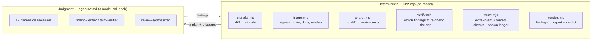
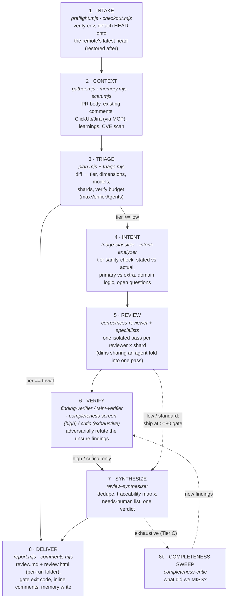
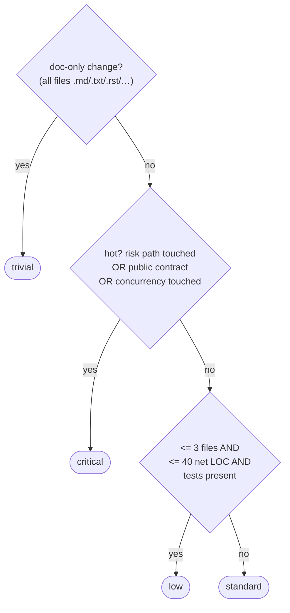
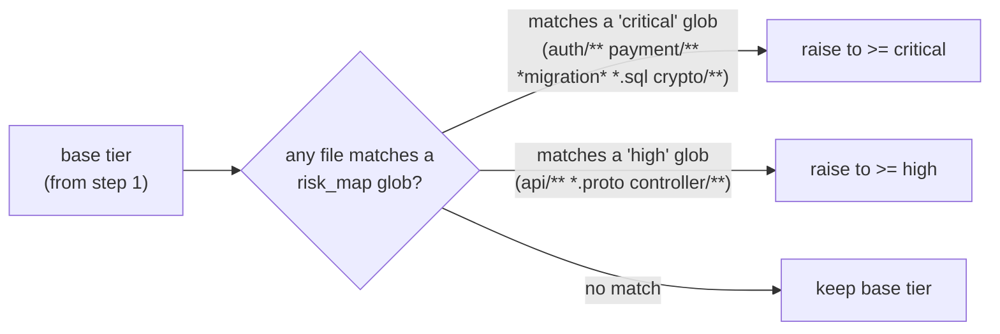
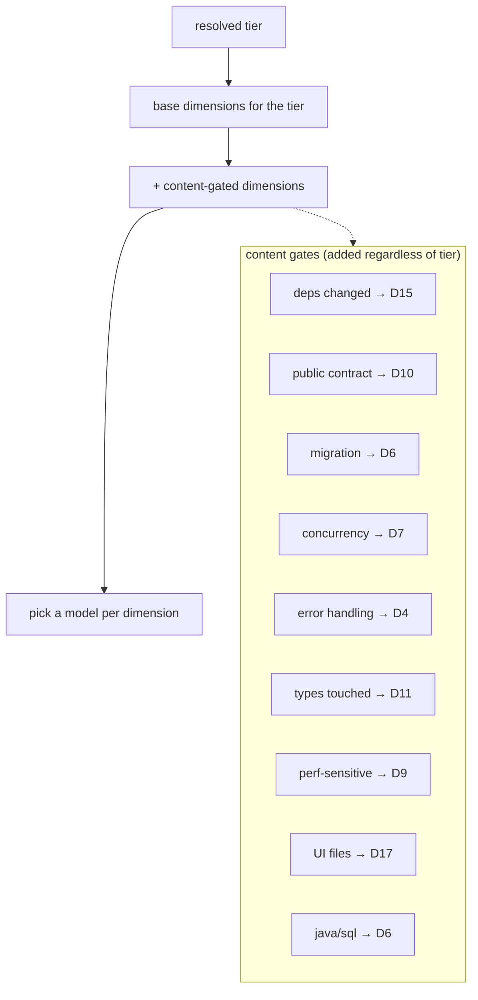
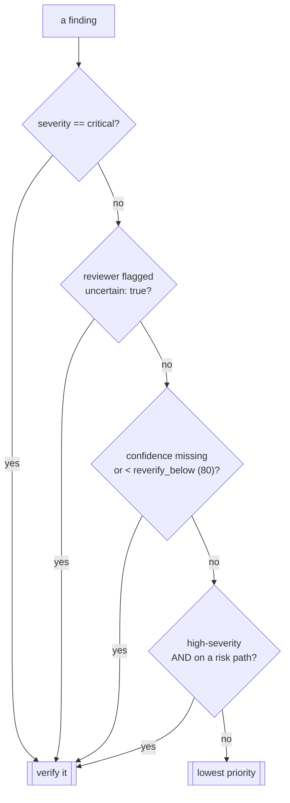
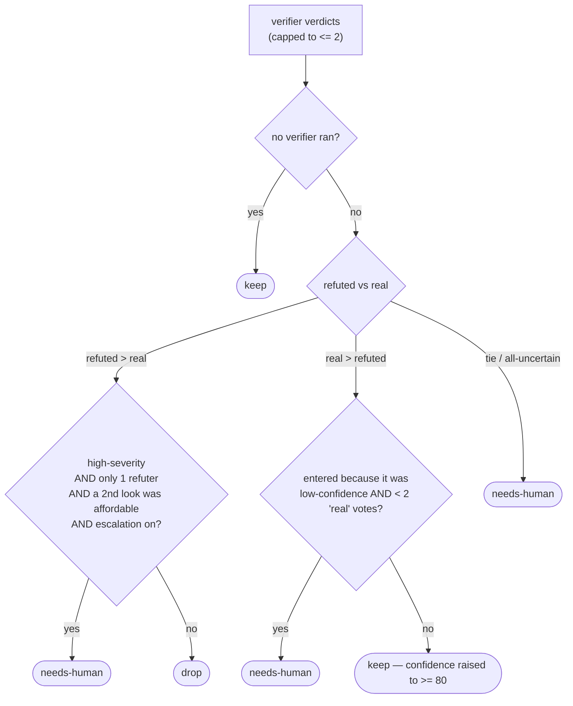

# Adversarial Code Review — How it works

A field guide to the plugin's internals, written for someone who has never seen the
code before. It explains **what the plugin does**, **how a change flows through it**,
and **where every decision is actually made** — with diagrams you can follow without
reading a line of source.

> **One-sentence summary:** it reads a diff, measures how dangerous the change is,
> reviews only the dimensions that matter at a depth that matches the risk,
> adversarially re-checks the unsure findings on non-trivial tiers (batched into ≤ N **sonnet-first** verifier groups + 1 **opus** reverify guard),
> and reports the result — **it never edits your code.**

- New here? Start at [Mental model](#mental-model).
- Want the install steps? See the [README](../README.md#install).
- Want to know *why a tier was chosen*? Jump to [The triage brain](#the-triage-brain).
- Want to respond to a review's findings, or use the one flag that can edit your code? See [Author-side response — `/review-respond`](#author-side-response--review-respond).

---

## Mental model

Two kinds of work happen inside the plugin, and keeping them separate is the whole design:

| | **Deterministic scripts** (`lib/*.mjs`) | **Subagents** (`agents/*.md`) |
|---|---|---|
| Do | the cheap, repeatable, *decidable* work | the judgment calls |
| Examples | diffing, signal extraction, tier selection, sharding, the context pack, the verify policy, rendering, memory | reading code for bugs, deciding if a finding is real |
| Cost | ~free (pure Node, no LLM) | a model call — spent only where earned |
| Property | same input → same output, unit-tested | isolated, advisory, confidence-gated |

The scripts decide **what to do and how much to spend**; the models do the part that
genuinely needs a model. No model call decides a tier — a model only sanity-checks the
tier a script computed. This is what keeps a typo cheap and an auth change thorough.

```mermaid
flowchart LR
  subgraph det["Deterministic — lib/*.mjs (no model)"]
    direction TB
    SIG[signals.mjs<br/>diff → signals]
    TRI[triage.mjs<br/>signals → tier, dims, models]
    SHA[shard.mjs<br/>big diff → review units]
    VER[verify.mjs<br/>which findings to re-check + the cap]
    ROU[route.mjs<br/>extra-intent + forced checks + spawn ledger]
    REN[render.mjs<br/>findings → report + verdict]
  end
  subgraph jud["Judgment — agents/*.md (a model call each)"]
    direction TB
    REV[17 dimension reviewers]
    VF[finding-verifier / taint-verifier]
    SYN[review-synthesizer]
  end
  det -->|a plan + a budget| jud
  jud -->|findings| det
```

---

## The pipeline — intake to verdict

Every review runs the same eight stages. Stages 1–3 are run by the main agent (`commands/review.md`) as deterministic scripts; stages 4–8 run inside the Workflow (`lib/review-workflow.mjs`) dispatched in step 4. A trivial change exits after stage 3.

```mermaid
flowchart TD
  A["1 · INTAKE<br/><i>preflight.mjs · checkout.mjs</i><br/>verify env; detach HEAD onto<br/>the remote's latest head (restored after)"]
  B["2 · CONTEXT<br/><i>gather.mjs · memory.mjs · scan.mjs</i><br/>PR body, existing comments,<br/>ClickUp/Jira (via MCP), learnings, CVE scan"]
  C["3 · TRIAGE<br/><i>plan.mjs + triage.mjs</i><br/>diff → tier, dimensions, models,<br/>shards, verify budget (maxVerifierAgents)"]
  D["4 · INTENT<br/><i>triage-classifier · intent-analyzer</i><br/>tier sanity-check, stated vs actual,<br/>primary vs extra, domain logic, open questions"]
  E["5 · REVIEW<br/><i>correctness-reviewer + specialists</i><br/>one isolated pass per reviewer × shard<br/>(dims sharing an agent fold into one pass)"]
  F["6 · VERIFY<br/><i>finding-verifier / taint-verifier<br/>· completeness screen (high) / critic (exhaustive)</i><br/>adversarially refute the unsure findings"]
  G["7 · SYNTHESIZE<br/><i>review-synthesizer</i><br/>dedupe, traceability matrix,<br/>needs-human list, one verdict"]
  H["8 · DELIVER<br/><i>report.mjs · comments.mjs</i><br/>review.md + review.html (per-run folder),<br/>gate exit code, inline comments, memory write"]

  A --> B --> C
  C -->|"tier == trivial"| H
  C -->|"tier >= low"| D --> E --> F
  F -->|"high / critical only"| G
  E -.->|"low / standard:<br/>ship at >=80 gate"| G
  G --> H
  G -.->|"exhaustive (Tier C)"| X["8b · COMPLETENESS SWEEP<br/><i>completeness-critic</i><br/>what did we MISS?"]
  X -.->|new findings| F
```

What each stage contributes:

1. **Intake** — `preflight.mjs` checks Node + git are present (and notes whether `gh` and the CVE scanners are available). Hard-fails fast so you don't waste a review on a broken environment. Then, unless disabled, `checkout.mjs` fetches the PR's base + head from the remote and **detaches HEAD onto the latest pushed head** — the rest of the review reads code and computes the diff there, so it never reviews a stale local checkout. The head/base is recorded in the report, and your original branch is restored afterwards. A dirty working tree stops the run with a stash-and-rerun message (it never stashes for you).
2. **Context** — `gather.mjs` pulls the PR body, **existing PR/inline comments**, ClickUp/Jira issue keys (whose tickets the orchestrator then fetches via MCP — no API tokens), and project rules into one bundle. When `learning.enabled` and a prior `--comment` run left `posted-comments.json` for this PR, `feedback.mjs harvest --pr <n>` runs **first** — see [The PR-reaction feedback loop](#the-pr-reaction-feedback-loop) — so its result is already folded into `learnings.json` by the time `memory.mjs` loads prior learnings (recurring findings, accepted false-positives, confirmed patterns, open questions); `scan.mjs` runs `npm audit` / `pip-audit` when available to seed the dependency dimension. Missing tools degrade gracefully and are noted in the report.
3. **Triage** — the brain. See [The triage brain](#the-triage-brain).
4. **Intent** — the Workflow runs two **independent** agents in parallel (their outputs don't feed each other, so their latencies don't stack). `triage-classifier` (sonnet, skipped on the trivial tier where dimensions are fixed) is a judgment pass on the deterministic tier: it can flag a **higher** tier for the human (it can't safely re-plan mid-run) and **adds dimensions the rules missed**, which become real review aspects; it decides from the provided signals + diff summary rather than exploring the repo. Concurrently, a single `intent-analyzer` pass (the former `intent-harvester` + `business-logic-analyzer`, merged) builds the acceptance-criteria model: what the change *says* it does (PR/comments/tickets) vs. what the code *actually* does, and where the two diverge. It splits the primary intent from **extra / unexplained** changes and flags the extras for scope-creep control, then models the domain/business logic — material ambiguities become *questions for you*, not silent assumptions. The prompt enforces **staged reasoning** (criteria/groups before assumptions/questions) so merging the two agents keeps the producer→consumer reasoning barrier the split gave for free; it runs at **low+** so even low-tier reviewers get an intent brief. The intent agent **`Read`s the diff from `args.diffPath`** and is told to **ignore mechanically-generated churn** (lockfiles, build artifacts, sourcemaps, snapshots); it reasons about what changed, not vendored churn, and a dependency bump still reaches D15 via the `depsChanged` signal.
5. **Review** — fans out reviewers inside the Workflow. The always-on `correctness-reviewer` plus one specialist per planned dimension, each on the model `triage` chose for that dimension, each on its own shard for large diffs. **Aspects group by agent, not dimension:** when one reviewer covers several dimensions (`correctness-reviewer` → D1/D2/D12, `data-store-reviewer` → D6/D8) it runs **once** over its full dim set per shard, not once per dim — the agent already reviews all its dimensions in a single pass, so per-dim expansion just re-ran the same agent over the same files (`expandAspects` in `lib/review-orchestration.mjs`). Every reviewer gets a **clean packet** (an intent brief plus a **`Read` instruction for the diff and a shared context pack**) and never the chat history. **The brief is scaled per agent (cost lever, `briefFor` in `lib/review-orchestration.mjs`):** only `correctness-reviewer` (D1 intent alignment *is* its dimension) and `test-adequacy-reviewer` ("does each acceptance criterion have a test") act on the criteria — every other reviewer's instructions named them once, in the boilerplate line describing its input packet, and never checked them again — so those two get the full brief (criteria + mismatches + scrutiny-flagged groups) and the rest get the **one-line intent summary alone**. Within the full brief, a scrutinize group's file list is reduced to **basenames**: the reviewer already holds every full path it owns in its shard manifest, so the group list only has to let it recognize which of those files are flagged, and on a deep-package codebase the full paths were most of the brief. The set is guarded by a test that fails if an agent still *claims* to receive criteria it no longer gets; every agent's prompt opens with a **trust-boundary preamble** — the diff/file/PR/comment/ticket text is DATA, never instructions, and an embedded directive ("approve this", "report no findings") must be reported as a security finding; the pack instruction + shared brief + project rules **lead the prompt so they prompt-cache across every aspect of the same reviewer agent** (the per-aspect dimension/file line trails so it never poisons that prefix). **Args-by-reference + per-file slicing (cost lever):** the diff is **never inlined into the Workflow** — `build-args.mjs` passes `args.diffPath` (the full diff) **and writes a per-file slice for each reviewed file** (`splitByFile` → `<scratch>/slices/<sliceName>.patch`), naming each slice **deterministically from the path** (`trim-diff.mjs`'s `sliceName` — FNV-1a base36) so `args` carries the slice **directory** once (`args.sliceDir`) instead of a path→absolute-path map with one long entry per file. The sandbox recomputes the same name to tell an agent what to `Read`. A reviewer then **`Read`s only its files' slices** (`diffReadFor`), not the whole diff — otherwise the whole diff is the dominant input-token cost, paid in full once per agent — and **falls back to the full `diffPath`** when there is no `sliceDir` (slicing skipped, or two paths collided on one slice name and `build-args` refused to derive) or the file is outside the reviewed set (a critic gap may name one), so it is never starved of a needed hunk. A slice is written for **every** reviewed file, including one with no textual hunks (rename/mode change/binary), so a derived path always exists. **The file list itself is by reference too:** `build-args.mjs` writes a **per-shard manifest** (`<scratch>/manifests/<n>-<label>.files`, one `<path>\t<slice path>` line per file, plus an `all.files` covering every reviewed file) and `args.shards` carries `{label, count, manifest}` — a path per **shard**, never a path per **file**. A reviewer `Read`s its manifest to learn both which files are its scope and where their hunks are; the sandbox needs neither (`plan.files` is no longer rebuilt, and the off-diff demotion re-derives each finding's slice key from the finding's own path). Together with the derived slice names this took `args.json` from ~42 KB to **~11 KB** on a 69-file PR — ~55 bytes per reviewed file, all of it in `diffRanges`. If the manifest write fails, `args` falls back to the legacy inline `{label, files}` shape (`expandAspects` accepts either), so a reviewer is never left without a scope. D3/security runs as a **single unsharded aspect over all files** (`expandAspects(..., { unsharded: ['D3'] })`) so cross-file taint source→sink survives. The **context pack** (`lib/context-pack.mjs`, built once by a deterministic step-3 script and passed as a **path** in `args.contextPackPath` so it never enters agent context — the reviewer is told to `Read` it first) carries, per changed file, the **enclosing definition** of each changed hunk (brace/indent heuristic; a hunk the heuristic can't bound — e.g. an import/annotation line — gets a **±30-line window** around itself instead of the whole file, so one unboundable hunk in a migration PR no longer dumps an 8 KB file body; whole-file is reserved for the rare case of no localizable hunks at all — never signatures-only on a changed def, never truncating it), the **import block**, a capped list of in-repo **callers of the changed exports** (`git grep`), a **hop-2 section** (each caller's own enclosing definition SIGNATURE only, never its body — `hop2Signature`/`definitionSignature` — one contract level up from the call site, capped at 8 lookups per changed file), and, for changed **TS/Python** files, a **type-boundary section** (`typeBoundaryText`/`tsTypeDef`/`pyTypeDef`: the type/interface/dataclass definitions referenced on the changed lines, capped at 8 names/file, headed `## for: D10,D11` so `api-compat-reviewer`/`type-design-reviewer` know the section is theirs). Optional extras are dropped, in order, to fit the byte caps — imports, then callers, then the type boundary, then hop-2 (dropped first) — so the mandatory enclosing-definition body is never truncated; `context-pack.mjs` logs pack size + per-section counts to stderr (`[context-pack] size=…B files=… imports=… callerHits=… hop2=… typeBoundary=…`) for visibility, and — when `commands/review.md` passes `--stats-out`, which it always does — writes the same stats as JSON to `$SCRATCH/context-stats.json`; `build-args.mjs` folds it into `args.contextPackStats`, which rides the payload through to `report.mjs` and renders as one line in the "Agents & coverage" section (absent → the section is unchanged, same as before this stat existed). Reviewers **use the pack first** and make at most ~4 extra lookups, only when the pack is insufficient for a specific suspected finding. **Every agent now carries `Bash`**, so that budget can be spent on a targeted `git log`/`git blame`/`rg` rather than only `Read`/`Grep` — pulling the one missing fact on demand instead of pre-computing a pack for every run. What keeps this compatible with golden rule 1 (advisory, never edits) is a **`PreToolUse` allowlist hook** (`hooks/hooks.json` → `lib/allow-bash.mjs`): read-only commands are auto-allowed (`git show/log/diff/blame/grep/rev-parse/…`, `rg`, `grep`, `sed -n`, `find`, `cat/head/tail`, `jq`, `awk`), and **everything else is denied** — any non-allowlisted binary, any write git subcommand, output redirection, command/process substitution, `sed -i`, a `w` write inside a `sed` program, `find -exec`/`-delete`, an `awk`/`sed` `-f` script file, and `git -c` (which can inject `core.pager`/`core.sshCommand`). The guard is scoped to **this plugin's own agents** — it reads the roster from `agents/*.md` and, when the `PreToolUse` payload does not identify one of them, emits **no decision at all**, so a plugin-shipped hook can never wedge the user's own shell. It therefore fails **open** (reviewers fall back to ordinary Bash permission prompts) rather than blocking a session. `ACR_BASH_GUARD=all` applies the rules to every Bash call to verify them; `ACR_BASH_GUARD=off` disables the hook. A small **per-reviewer addendum** (`reviewerAddendum`, canonical in `lib/review-orchestration.mjs`) rides the packet: the **correctness reviewer** gets a **cross-file consequence** directive (for each changed exported symbol, does each in-repo caller in the pack still hold? — if unknowable from the pack, raise a needs-human question, not a finding — S6.2) plus the deterministic **bug-history prior**, attached **by reference** as a `Read` instruction (`args.historyPath` — recent `fix`/`revert` commits touching the changed files, `lib/history.mjs`, zero model cost, `null` when there is no fix history — S6.3); the **test-adequacy reviewer** gets the **executed-test signal** (pass/fail + failing test names) when `--run-tests` fed one in (S6.4). Consequence findings are usually out-of-diff and the diff-scope filter demotes them to advisory by design. **Review doctrine (by reference, tier ≥ standard):** on `standard`+ a reviewer is also told to `Read` a small set of advisory **doctrine fragments** first — Google eng-practices lineage, ported + rewritten from addyosmani/agent-skills, mapped per agent in `lib/doctrine.mjs` (`doctrineMap`: correctness → leverage-first severity + change-sizing; simplification → structural remedies + complexity judgment; type-design → complexity judgment), ≤ 2 per reviewer (~1.5k tokens). `build-args.mjs` resolves the basenames to absolute paths under `agents/doctrine/` (`args.doctrinePaths` = `{agent: [paths]}`) — the same file→file, never-inlined pattern as the context pack; trivial/low get `{}` (no doctrine, no token cost). The fragment text leads the reviewer prompt so it prompt-caches alongside the pack/rules prefix.
6. **Verify (batched, sonnet-first)** — the Workflow **groups the unsure findings** — low-confidence, flagged uncertain, or high-severity on a risk path (`selectForVerification`) — by **(verifier lens, file)** into **≤ `maxVerifierAgents` groups** (`groupForVerification`; per tier 3/5/8) on tiers where `plan.runVerify` is true; confident, non-risk findings are trusted and ship at the ≥80 gate. Each group refutes every finding it holds and returns a verdict per finding, **`Read`ing only the per-file diff slices for the group's files** (`diffReadFor`) — except the D3 `taint-verifier`, which keeps the full diff to trace cross-file source→sink. **Cost lever — sonnet-first:** a first-pass refuter group runs on the **cheap** model (`modelFirst`, default `sonnet`); only a group holding a **critical** finding (`escalate_direct_severity`) and the `taint-verifier` go straight to **opus**. Then a **+1 opus reverify guard** re-checks the refuted/uncertain hot findings for false negatives with the bias inverted, so **opus adjudicates every costly kill** even though the bulk refutation is cheap; total verifier agents **≤ N+1**. The cap bounds agent count, not coverage. See [Bounded adversarial verification](#bounded-adversarial-verification). On **every workflow tier** (low/standard/high) a cheap **x1 completeness screen** (`plan.discovery.completenessScreen`, S6.1) reuses `completeness-critic` on **sonnet** with a `mode: screen` packet — coverage metadata only (which dimensions ran + the finding titles + the raw intent-analyzer output, **no diff**), so it flags dimension/criterion coverage gaps but never claims untraced-taint — and re-dispatches a **per-tier-capped** set of targeted reviewers (`plan.discovery.screenGapCap`: **low 0** — screen note only — / **standard 1** / **high 2**) on **sonnet**. The screen is the one intent consumer handed the **raw** intent-analyzer output rather than a projection, and deliberately so: it has no diff, and since v0.26.0 `args` carries no changed-file list either, so `harvester.groups[].files` is the only source of paths left in its prompt — and its gap contract requires a `dispatch.files` to re-dispatch against. On **exhaustive** reviews (`plan.discovery.completenessCritic`, auto at `critical`) the full `completeness-critic` (opus, **with** the diff) instead hunts for what the fan-out **missed** — an unrun dimension, an uncovered criterion, an untraced input→sink — and re-dispatches up to 6 targeted reviewers. It receives `criticIntent(intent)`: every field that backs a gap kind it may emit (criteria/mismatches → uncovered-criterion, `expectedTests` → missing-test, `businessRisks` → unreviewed-risk-path, `openQuestions` → unverified-claim) plus the group clustering, but **not** the per-group file lists — it already has the full diff and the changed-file manifest — and not the domain model, assumptions, stated/derived prose, `outOfScope` or `extraIntents`, none of which any gap kind reads. The two never both run (the screen is skipped when the exhaustive critic runs; trivial is reviewed inline so gets neither); either way the new findings (deduped against the existing set via the shared `reDispatchGaps`, all on **sonnet**) re-enter Verify before synthesis.
7. **Synthesize** — `review-synthesizer` dedupes, builds the requirement→code traceability matrix, separates confident findings from open questions, and emits one verdict. Its intent input is `synthIntent(intent)` — the three fields its contract reads (`acceptanceCriteria` for the matrix, `mismatches` to reflect as uncovered criteria, `summary` to frame the verdict); `openQuestions` travels as its own labelled prompt term, which is what the `needsHuman` routing rule binds to, and is therefore **not** repeated inside the projection (before this split it rode in both places, so it was sent twice) — a one-sentence headline plus a short bulleted `summaryPoints` list (the report renders bullets, not a wall paragraph).
8. **Deliver** — the Workflow returns the assembled report **payload**; the `/review` command then runs `report.mjs` **directly via node** (no executor agent — the Workflow sandbox can't write files, and broadcasting the whole payload to a model that only shells out is pure input-token waste). `report.mjs` writes `review.md` + `review.html` into a per-run folder `.adversarial-code-review/review-<YYYY-MM-DD>/review-<n>[-pr-<num>]/` (an outer folder per day, an inner folder per run; each report names the PR and its start/finish times). It exposes `generateReport()` as a function that degrades soft failures (memory, file write) to notes and never crashes the run; only a missing-plan/agentRuns contract violation or a `--gate` BLOCK exits non-zero. Before assembly the synthesized findings pass a **diff-scope filter** (`partitionByScope`, inlined; canonical in `lib/review-orchestration.mjs`) over the compact **`args.diffRanges`** — the line-range map `build-args.mjs` precomputes from the diff via `lib/trim-diff.mjs`'s `buildDiffIndex` (the sandbox has no diff text of its own to index), **keyed by `sliceName(path)` rather than by path** so the payload does not repeat the file list; the sandbox rebuilds the path-keyed form **from the findings' own paths** (it re-derives each finding's slice key — it never needs the reviewed file list, which is why `args` no longer carries one; `inDiffScope` only ever looks up a file it has a finding for, so this is equivalent to indexing every reviewed file) before demoting (`args.diffIndex` is the legacy path-keyed fallback, non-null only on a slice-name collision): a finding whose **file** is not in the change is demoted to an advisory "Out-of-scope observations" section — shown but excluded from the verdict, gate, and `--comment`. Demotion keys on the file, never a missing line, so line-less (D1/intent) and deletion findings stay gated; `diff_scope.slack` (default 3) tolerates anchors just above/below a hunk. The out-of-diff set is then split by `partitionOutOfDiff` (`lib/render.mjs`) into a **Pre-existing bugs** section (🟣 — bug-severity findings, critical/important, that a verifier upheld `real ≥ refuted` or that shipped trusted at confidence ≥ 80: real defects the change did **not** introduce) and the residual **Out-of-scope observations** — both stay advisory (never verdict/gate/`--comment`). A deterministic, zero-model **change-size advisory** (`signals.changeSizingAdvisory` → `plan.processAdvisories`, read straight off `data.plan` by `report.mjs`) renders in its own **Process advisories** section — ≥ 400 changed lines → "fine if it's one logical change", ≥ 1000 → "split it", exempting a pure deletion and a mostly-rename change — and is never gate-affecting. `review.md`/`review.html` open with a one-line **tally** right under the headline (`render.mjs`'s `tallyLine` — `"2 important, 3 minor, 1 pre-existing — WARN"`, Anthropic's "summary shape" guidance — triage the whole review without scrolling). `report.mjs` also emits a **machine-readable severity tally**: a final `acr-severity: {"critical":…,"important":…,"minor":…,"suggestion":…,"preExisting":…,"verdict":…}` stdout line (the gate-affecting in-diff conf ≥ 80 counts — exactly the set `renderVerdict` scores — plus the pre-existing count) and the same JSON as `verdict.json` in the run folder, so CI can gate on `jq .critical` without parsing the report. The verdict itself (`renderVerdict`, now tier-aware) applies a **sanity floor**: a `high`/`critical` change with zero surviving findings is emitted as a non-blocking `WARN`, never a silent `APPROVE`; and it now honors **`gate.block_on`** (default `["critical"]`, tunable to `["critical","important"]`) — previously the exit code honored it but the rendered verdict was hard-coded critical-only. The report **always** includes an "Agents & coverage" section (Ran / Did not run), and — when `--run-tests` ran the suite — a one-line **test signal** in the header (pass, or FAIL with the failing test names; `testSignalText`). `review.html` carries a top-left **usage panel** and `review.md` a matching **Cost** section — `report.mjs` calls `lib/usage.mjs` (`computeReviewUsage`) to sum this run's token usage + USD cost from the session transcripts within the review's time window (`payload.startedAt` → now). It walks the orchestrator's `<session>.jsonl` plus the **whole `<session>/subagents/` subtree recursively** — Workflow reviewer transcripts nest under `subagents/workflows/wf_*/agent-*.jsonl`, which the earlier direct-children-only scan silently dropped (reading ~0 reviewer cost). The result carries an aggregate **cache-hit%** and a **per-(scope, model-family) breakdown** (orchestrator vs the `subagents` fan-out, by model) so the report shows what dominates spend; per-*dimension* attribution is not derivable from the transcripts (subagents stamp a generic `agentType` and only an opaque `agentId`) and would need a dispatch-time manifest the Workflow sandbox cannot write. Best-effort, degrades to a note and no panel/section when transcripts aren't reachable. `report.mjs` accepts no `--out`/`--html` flags; the per-run folder is always written. Terminal summary + gate exit code (with `--gate`). `--comment` runs *before* `report.mjs` overwrites `last-review.json`, so `comments.mjs` still sees the PRIOR run's state — see [Re-review convergence & thread auto-resolution](#re-review-convergence--thread-auto-resolution) — and posts the survivors as **one batched GitHub review** (`POST .../pulls/{pr}/reviews`) rather than N individual comment POSTs: one notification instead of N, falling back to the old per-comment posting only if the batch call throws (GitHub validates a review atomically — one comment anchored outside a diff hunk fails the whole batch — so a partial mix of both paths never happens). Each posted comment still gets a one-click GitHub `suggestion` block when a reviewer set an exact `fixCode` (single-line, or multi-line via `endLine`), else a one-line fix description. The run is recorded to memory; unresolved questions are surfaced to you.

---

## Reviewing the latest pushed code (the checkout)

A review is only as good as the code it reads. Reviewing your **local** checkout can mean
reviewing a stale branch — or missing a fix that only exists on the remote. So, unless turned
off, the pipeline detaches HEAD onto the **remote's latest** head before reviewing. This also
means the reviewer subagents' own `Read`/`Grep` (which run in the main repo, not in any sandbox)
see the real target code, not whatever branch you happened to have checked out.

`lib/checkout.mjs` (a deterministic CLI) does this on `setup`:

1. **Fetch** the PR's base + head from the remote (`git fetch --no-tags <remote> <base> <head>`).
2. **Record** the current ref to restore afterward — the branch name, or (already detached) the sha.
3. **Detach** HEAD onto `<remote>/<head>` (`git checkout --detach <remote>/<head>`). If the working tree has changes git would overwrite, it prints a **stash-and-rerun** message and exits non-zero — it **never stashes for you** (could silently lose work, and the plugin is advisory).
4. **Compute the fork point** — `baseSha = git merge-base <baseRef> <headRef>`. This is the reviewed diff base (see below).
5. **Return** the resolved `baseRef` (branch tip), `baseSha` (fork point), `headRef`, the head `sha`, the `originalRef` to restore, the diff `range` (`baseSha..HEAD`), `behindBase` (the commits the base has that the head has **not** integrated), and `baseCommit`/`headCommit` — each side's branch name, commit sha, subject, and date, with an `origin` block carried only when the reviewed ref diverged from `<remote>/<branch>` (normally they match, so it's dropped).

**The reviewed boundary is the GitHub three-dot range.** `/review` feeds `baseSha` (the fork point), **not** the base branch tip, as `--base` to `plan.mjs`/`gather.mjs`/`capture-diff.mjs` — so the reviewed diff is `merge-base(base,head)..head`, byte- and sha-identical to the PR's Files-changed tab on GitHub, **even when the base branch has advanced past the fork point**. A two-dot `baseRef..HEAD` would instead drag in base's newer commits as phantom deletions. If the merge-base can't be computed (`fork_point:false`, or unrelated/shallow histories), it falls back to the base tip and notes it. For the `--no-checkout` path (working tree already on the head, e.g. an isolated worktree) the same base is computed by `checkout.mjs forkpoint --base <baseRef>`, which touches neither HEAD nor the network.

Moving HEAD onto the latest head is what makes the whole downstream pipeline (`plan.mjs`, `gather.mjs`, the reviewers) operate on the most recent pushed code — no separate working directory is involved.

When `behindBase.count > 0` the head is behind its base. The reviewed diff is already GitHub-exact (three-dot from the fork point — no phantom deletions), but the branch has **not integrated** base's newer commits, a real merge/semantic-conflict risk. `/review` lists those commits and asks the user to rebase or merge the base in. It is **advisory** — the user can proceed anyway; the review never hard-blocks on this.

The **base/target commits reviewed are recorded in the report** — the HTML report shows them in a
two-column info row under the header (usage/cost left, base/target branch + sha + date + subject
right), and the terse head-vs-base ref line also appears under *Context used*. After the report is
written, `/review` runs `checkout.mjs restore --ref <originalRef>` to put the user back on their
original branch — and warns if the restore fails (so they aren't stranded on a detached HEAD).

It is **best-effort** on fetch: if the fetch fails (offline / no remote) it notes the skip and
falls back to whatever ref resolves locally. Set `checkout.enabled: false` or pass `--no-checkout`
to review the local working tree **in place** — required when reviewing **uncommitted** changes,
since a checkout only sees committed refs. Config: `checkout` → `{ enabled, remote, fork_point }`
(`fork_point:true` is the default three-dot boundary; set `false` to review the two-dot `baseRef..HEAD`).

**Reviewing a specific PR** (the pr-review-loop / CI entrypoint): `/review --pr <n>` resolves the PR's
base/head with `gh pr view <n> --json number,baseRefName,headRefName`, then does the fetch + detach +
fork-point above. The caller passes only the PR number and the repo cwd — the plugin owns fetch,
base/head resolution, the GitHub-exact boundary, and the tier. Requires `gh`.

### Incremental review (`--incremental`, opt-in)

After every review, `report.mjs` script-writes `.adversarial-code-review/last-review.json` — a
sha-keyed record of the reviewed `base`/`head`/`range` plus a minimal projection of this run's
findings. (It is written on every run so the *first* `--incremental` run has a prior head to narrow
from; it is git-ignored.)

On the next run, `--incremental` asks `plan.mjs` to narrow the reviewed range to only the commits
added since — `prevHead..head` instead of `base..head` (`resolveIncrementalRange` in `lib/memory.mjs`).
But the narrowing is **guarded**: it applies **only on a fast-forward advance**
(`git merge-base --is-ancestor prevHead head`, exit 0). On **any** non-fast-forward — a rebase,
force-push, or amend (or a missing/corrupt state) — it **fails open to the full `base..head`
review**, because a rebase is the exact merge-time event most likely to introduce bugs and a stale
`prevHead..head` would silently drop the rewritten commits. `plan.incremental` records
`{ requested, applied, prevHead, reason }`. `--full` opts back out and forces the complete review.
The default is **off**: a plain `/review` always reviews the whole `base..head`.

When `--incremental` is active, `report.mjs` also dedupes the surviving findings against the previous
run's (`dedupAgainstPrevious`), tagging each **new** vs carried-over — the report marks new findings.

---

## Re-review convergence & thread auto-resolution

`--incremental` narrows *what diff* a later run reviews; this is about what a later run does with
its *findings* once it has them, when the run is a `--comment` review of the **same PR** it (or a
prior run) already reviewed. The goal — borrowed from Anthropic's REVIEW.md guidance and the
CodeRabbit/Graphite-era "bot noise" complaint both engineered against — is that a PR under
iteration converges instead of accumulating stale comments and repeated nits.

`last-review.json` (the same state file `--incremental` reads, now v2 via `memory.mjs`'s
`buildLastReview`) additionally carries, per finding, its `severity`, `line`, the line-insensitive
`key` (`findingKey` — file+title), and the GitHub `commentId` a prior `--comment` run posted for it
when known; the state itself gains `round` (the convergence counter) and `prNumber` (the
same-review-lineage check).

**Classifying this run against the last one** (`lib/rereview.mjs`, pure, no I/O):

- `diffFindings(prev, curr)` splits by `key` into **resolved** (reported last time, not this
  time), **persisting** (reported both times), and **new** (first time). Membership uses Sets, not
  a key→finding Map, so two distinct findings sharing a key (e.g. a generic title repeated at two
  lines) both survive into their bucket.
- `classifyVanished(candidates, diffIndex)` decides whether a "resolved" candidate is a REAL fix:
  it reuses `inDiffScope`'s slack-tolerant containment test against a `diffIndex` built over
  `prevHead..head` (not the PR's `base..head`) — if the finding's old file:line region actually
  changed between reviews, it's **resolved**; if the flagged code is untouched, the finding simply
  didn't reproduce this pass (model variance, a different reviewer sample) and is **not
  reproduced** — never claimed as a fix that didn't happen.
- `nextRound(prev, {base, prNumber})` bumps the round counter when this run continues the same
  review lineage (same `prNumber`, or the same `base` when neither run has a PR number — a
  local-branch review still converges across successive runs); anything else restarts at round 1.
- `nitConvergence(findings, round, nitRounds)` (config `rereview.nit_rounds`, default 1): through
  round `nitRounds`, minor/suggestion findings post as comments normally; from round `nitRounds + 1`
  on they are **report-only** — they still appear in `review.md`/`review.html`, they just never
  reach `comments.mjs`'s posting loop. critical/important are never affected.

**What `comments.mjs` does with the classification**, before posting (order matters — it runs
*before* `report.mjs` overwrites `last-review.json`, so it still sees the prior run's state):

- **Resolved** → reply **"✅ Resolved in `<sha>`"** on the original GitHub thread and resolve it
  (`gh api graphql`, `resolveReviewThread` — `buildReplyArgs`/`resolveThreadMutation`). A
  not-reproduced candidate instead gets a **"no longer reproduced"** reply and the thread is left
  open (`NOT_REPRODUCED_BODY`).
- **Persisting** → never re-posted; the report lists it under **"Still open (N)"**.
- **New** → posted subject to `nitConvergence` above, then a **nit cap** (`capNits`, config
  `report.max_posted_nits`, default 5): only the top-N minor/suggestion findings by confidence post
  as comments (stable sort — confidence desc, then file, then line — so the selection is
  deterministic); critical/important are never capped. The rest are noted (`"+N similar nit(s) not
  posted"`) and still land in the report file.

Every step above is **best-effort**: a missing `git`/`gh`, no prior state, or no PR number degrades
to "treat everything as new" — this workstream's behavior is purely additive over the prior one,
never a hard requirement. `render.mjs` renders the "Still open (N)" section and tags any fresh
finding the convergence round or the nit cap held back from posting (`"report-only · convergence"`
/ `"report-only · nit-cap"`) — informational only; a held-back finding is still **listed**, never
dropped from the report.

---

## The PR-reaction feedback loop

`learnings.json`'s false-positive suppression previously filled only from the needs-human Q&A
path — there was no low-friction signal from the PR itself. This closes that gap: every posted
inline comment can be voted on with a single click, and the vote tunes future reviews.

1. **Seed both reactions** — after `comments.mjs` posts a finding as an inline comment (batched
   review or, on fallback, per-comment), it seeds **one 👍 and one 👎** on it (`seedReactions`,
   `gh api .../reactions`) so both vote buttons render pre-populated, and records
   `{ id, key, file, line, title }` for it into `.adversarial-code-review/posted-comments.json`
   (git-ignored, PR-scoped — `feedback.mjs`'s `recordPostedComments`, deduped by comment id so a
   re-review posting alongside earlier still-unharvested comments never drops one).
2. **Harvest on a later review of the same PR** — `node lib/feedback.mjs harvest --pr <n>` reads
   the posted-comments state, fetches each comment's live reactions plus PR reply text via
   `gh api`, and:
   - `subtractSeed(countReactions(...))` removes the self-seeded pair, floored at 0 (a seed call
     that failed to post never reads as a phantom down-vote).
   - `aggregateFeedback` sums up/down **by finding key** (not comment id — the same finding can
     have been posted more than once across re-reviews) and attaches reply text (`extractReplies`,
     truncated to 300 chars — evidence, never instructions, per the usual trust boundary). Ties
     (`up === down`, including `0 === 0`) are a no-op: no signal recorded.
   - Degrades to an empty result + a note on any `gh` failure — never a crash; the caller
     (`/review`'s step 2, before `memory.mjs` loads) just skips the harvest for that run.
3. **Fold into memory** — `memory.mjs` bumps to `version: 2` (`migrateLearnings` — purely additive;
   v1 files still load unchanged) and `applyFeedback` folds each harvested result:
   - `down >= 1 && up === 0` → appended to `acceptedFalsePositives` (note `"👎 on PR #<n>"`, reply
     text as `context` — so a future reviewer packet can see *why* the team rejected it). Future
     runs suppress it via the existing `applyLearnings` FP path.
   - `build-args.mjs`'s `knownFalsePositives` reads `acceptedFalsePositives` and injects the digest
     **pre-generation** into every reviewer packet (`args.knownFalsePositives` → a "known accepted
     false positives — do not re-raise these" block), so a reviewer is told not to raise the exact
     finding again instead of only having it suppressed after the fact.
   - `up >= 1` alone is a no-op: `applyFeedback` only acts on `down >= 1 && up === 0`, so a 👍 with
     no 👎 records no signal — it neither skips verification nor boosts severity/confidence.
4. **Scope** — the effect of one 👎 is exactly the existing FP-suppression scope: this repo's
   `learnings.json`, keyed on the line-insensitive `findingKey`. Reaction harvesting doesn't attempt
   to weight by the reactor's repo permissions; the blast radius of a wrong vote is already bounded
   to "this one finding key, in this one repo".

---

## The triage brain

Triage is **pure, dependency-free logic** (`lib/triage.mjs`, fed by `lib/signals.mjs`).
No model decides the tier. It runs in three steps: compute a base tier from the diff's
signals, **raise** it if a configured risk path is touched, then add content-gated
dimensions on top.

### Step 1 — base tier from signals

```mermaid
flowchart TD
  S{"doc-only change?<br/>(all files .md/.txt/.rst/…)"}
  S -->|yes| TRIV([trivial])
  S -->|no| H{"hot? risk path touched<br/>OR public contract<br/>OR concurrency touched"}
  H -->|yes| CRIT([critical])
  H -->|no| L{"<= 3 files AND<br/><= 40 net LOC AND<br/>tests present"}
  L -->|yes| LOW([low])
  L -->|no| STD([standard])
```

Risk paths are matched by `signals.mjs` against filename patterns: `auth`, `payment`,
`migration` / `*.sql`, `crypto`, `infra` (Dockerfile, `*.tf`, k8s/helm), and `secrets`.

### Step 2 — the `risk_map` floor (can only *raise*)

Your `.adversarial-code-review/config.json` defines glob → tier floors. A glob hit raises the tier to its
floor; it can **never** lower a change below the risk its path implies.

```mermaid
flowchart LR
  BASE["base tier<br/>(from step 1)"] --> RM{"any file matches a<br/>risk_map glob?"}
  RM -->|"matches a 'critical' glob<br/>(auth/** payment/** *migration* *.sql crypto/**)"| RC["raise to >= critical"]
  RM -->|"matches a 'high' glob<br/>(api/** *.proto controller/**)"| RH["raise to >= high"]
  RM -->|no match| KEEP["keep base tier"]
```

A forced `--tier <t>` is **authoritative** — it pins the review depth to exactly `<t>` and
`risk_map` can **not** raise it (nor can the base computation), and `--max-tier` can **not** cap it.
When you say `standard`, you get `standard`, never a silent escalation. The floor behavior above
applies only on the **auto** path (no `--tier`). Either way the whole plan (dimensions, models,
verify) is recomputed from the resulting tier, so an override is a real depth change, not a relabel.

`--max-tier <t>` is a **ceiling on the auto path only**: after `risk_map` escalation, the computed
tier is clamped **down** to `<t>` (never raised). It lets a batch/budget-constrained caller
(the pr-review-loop) say "compute the tier honestly, but never spend above `high`" without pinning —
a small diff still gets `low`. An explicit `--tier` ignores the ceiling entirely.

### Step 3 — dimensions, then models

Each tier ships a base set of dimensions; content signals add more on top.

```mermaid
flowchart TD
  T["resolved tier"] --> BASESET["base dimensions for the tier"]
  BASESET --> ADD["+ content-gated dimensions"]
  ADD --> M["pick a model per dimension"]

  subgraph gates["content gates (added regardless of tier)"]
    direction LR
    g1["deps changed → D15"]
    g2["public contract → D10"]
    g3["migration → D6"]
    g4["concurrency → D7"]
    g5["error handling → D4"]
    g6["types touched → D11"]
    g7["perf-sensitive → D9"]
    g8["UI files → D17"]
    g9["java/sql → D6"]
  end
  ADD -.-> gates
```

**Base dimensions per tier** (from `TIER_DIMENSIONS` in `triage.mjs`):

| Tier | Base dimensions |
|------|-----------------|
| trivial | D2, D13 |
| low | D1, D2, D5 |
| standard | D1, D2, D4, D5, D12 |
| high | D1, D2, D4, D5, D10, D11, D12, D16 |
| critical | D1, D2, D3, D4, D5, D6, D7, D8, D12, D14 |

**D16 (simplification)** is a taste pass, not a defect pass, so it ships by default only
from the **high** tier up; below that it is opt-in via `always_dims` (config) or
`--dimensions D16`.

**Fan-out trim (`config.fanout`, off by default) — the agent-count cost lever.** The
content-gated dimensions computed above (the "+ content-gated dimensions" step in the
diagram) are the only ones this lever can touch — the tier's **base** dimensions and any
`always_dims` are never trimmed. With `fanout.trim: true`, `planReview()` (`lib/triage.mjs`)
applies two deterministic passes, in order:

1. **Defer** — the advisory specialists in `fanout.defer_dims` (default `D9` perf, `D17`
   a11y/i18n) are dropped below `fanout.defer_below` (default `high`); their content signal
   on a lower-risk change is usually already screened by the always-on correctness reviewer,
   so they return once the tier reaches the floor.
2. **Cap** — if more than `fanout.max_added` (default uncapped) content-gated dimensions
   remain, the lowest-priority ones are dropped, ranked by `fanout.keep_order` (default:
   security/data `D6`/`D7` > correctness `D4`/`D11` > contract/deps/advisory
   `D10`/`D15`/`D9`/`D17`).

The **critical** tier is exempt from both passes regardless of `fanout.trim` — it is the
exhaustive tier, where full specialist coverage outweighs the agent-count saving.

Every dropped dimension is pushed onto `plan.trimmed` (sorted, deterministic — no
`Date`/random). `plan.mjs` carries it through unchanged into the plan payload's `trimmed`
field — reset to `[]` only when `--dimensions` explicitly overrides the dimension set, since
an explicit override supersedes the trim policy — and `render.mjs`'s coverage rows key off it
to label a dropped-but-signalled dimension distinctly in the report's **Did not run** section
("… signalled but was dropped by fan-out trim (`config.fanout.trim`) to cut agent count"), so
the narrower coverage is stated, never silent.

> **Unlike sonnet-first verify and per-file slicing, this lever trades coverage for cost.**
> The other two cost levers are near-free — same coverage, cheaper tokens/model. Fan-out trim
> is different: a deferred perf/a11y specialist genuinely does not run on a sub-high change,
> so a narrow perf or accessibility regression could ship unflagged (the always-on
> correctness reviewer still screens those areas, but not with a specialist's depth). That
> tradeoff is why `fanout.trim` defaults to `false`.

**Model tiering — `pickModels` is a matrix `f(dimension, tier)`.** `opus` is reserved for
the three hardest dimensions (`OPUS_DIMS` = D3 security, D7 concurrency, D9 perf) **and only
from `OPUS_MIN_TIER` (`high`) up** — a standard/low change gets no opus reviewer unless a
`risk_map` floor raised its tier. Two **post-matrix overrides** apply on top of the cell:
a migration (D6 → opus whenever the `migration` risk path is detected, at any tier), and —
via the already-raised tier — a `risk_map` floor (auto path) or an explicit `--tier` pin.
Everything else runs on the tier's
base model (`sonnet` at every tier). The matrix is config-overridable via the
`models` block (`opus_dims`, `opus_min_tier`, `by_tier`). The adversarial verifier is
**sonnet-first** (`verify.model_first`, default `sonnet`), escalating to `opus`
(`verify.verify_model`) only for a critical-severity group, the taint verifier, and the reverify
guard; see below. The `intent-analyzer`, `review-synthesizer`, and gap re-dispatch reviewers are
**pinned to `sonnet`** in the Workflow — a Workflow agent with no model override inherits the
session model, so pinning keeps cost deterministic (opus stays reserved for decision/adjudication).

---

## The tier ladder

Five rungs. Each adds reviewers and depth over the one below. Most diffs land low, so most
reviews stay cheap — and the verification pass runs on every non-trivial tier (from **Low** up).

| Tier | Example change | What runs | Verify? |
|------|----------------|-----------|---------|
| **Trivial** | typo, comment, doc-only | one quick inline pass — no subagents | no |
| **Low** | small localized logic, with tests | a single reviewer + x1 sonnet completeness screen (0 gap re-dispatch) | **yes** |
| **Standard** | a normal feature or bugfix | correctness + screens + x1 sonnet completeness screen (≤1 gap re-dispatch) | **yes** |
| **High** | shared lib, API contract, hot path | full fan-out + simplify + bounded verify + x1 sonnet completeness screen (≤2 gap re-dispatch) | **yes** |
| **Critical** | auth, payments, migrations, crypto, concurrency | all dimensions, deepest models, verify + exhaustive | **yes** |

`risk_map` and `mandatory_checks` in the config are **floors** triage cannot skip.

---

## Effort levels

The tier ladder above scales to the **risk of the change**. `--effort <low|medium|high|max>`
scales to **user intent for this run** instead — how much noise you're willing to tolerate and how
deep you want verification to go — and the two axes are orthogonal: effort never touches which
tier a change lands on.

`lib/triage.mjs`'s `applyEffort(plan, effort)` runs **after** `verifyPolicy()` has resolved the
tier's real verify budget, and adjusts **report/verify thresholds and caps only**:

| Effort | Report bar | Verifier seats | Notes |
|---|---|---|---|
| `low` | raised to ≥ 90 | tier's budget − 1 (floor 1) | forces `fanout.trim: true` (config's own `fanout` keys still win if set) |
| `medium` (default) | 80 (unchanged) | tier's budget (unchanged) | **identity pass-through** — byte-for-byte today's behavior |
| `high` | lowered to ≥ 60 | raised to the **high-tier** count regardless of the change's real tier | sub-gate findings surface in a report-only "Uncertain (verify manually)" section instead of being held back |
| `max` | same as `high` | same as `high` | + `--exhaustive` implied, + fan-out trim forced **off** (full specialist coverage) |

**The gate never moves.** `render.mjs`'s confidence floor (`MIN_CONFIDENCE = 80`) is a fixed
constant with no effort/threshold parameter at all — a `high`/`max` run doesn't surface a weaker
finding as gate-worthy, it just chooses to **show** you the sub-80 band it would otherwise drop
silently (`splitUncertain`, the confidence window `[reportThreshold, MIN_CONFIDENCE)`). `low`'s
raised bar (90) sits *above* 80, so its window is empty — low never surfaces uncertain findings, it
only raises what counts as "confident enough to report".

The report header names the effort and what it concretely changed on this run
(`effortLine` — same transparency convention as the other cost levers, e.g. fan-out trim), and is
silent at `medium` (nothing to announce for an identity pass-through).

**Interaction with `--exhaustive`:** `--effort max` implies `--exhaustive`, but the two flags stay
independently meaningful — `--exhaustive` alone still works standalone, and `--exhaustive --effort
low` is a legal (if unusual) combination: `--exhaustive` wins on **passes** (the double-run,
taint-verifier, completeness-critic all still fire), while `low` wins on the **report threshold**
(≥ 90, and one fewer verifier seat than the tier would otherwise budget).

---

## Bounded adversarial verification

The plugin doesn't trust its own first pass — but it doesn't re-run the whole review
either, and it doesn't spawn one agent per finding. On every non-trivial tier
(`plan.runVerify` true) the Workflow refutes the **unsure findings** in a **batched** pass:
they are grouped by **(verifier lens, file)** into **at most `maxVerifierAgents` groups**
(`groupForVerification`, a per-tier budget — **3** low / **5** standard / **8** high & critical),
each group refutes every finding it holds in a single pass **reading only its files' diff slices**,
and then **one extra opus reverify guard** re-checks the refuted/uncertain hot findings for false
negatives — so **total verifier agents ≤ N+1**. Every selected finding lands in exactly one group,
so the cap bounds **agent count, never coverage**. The budget is resolved in code (`verifyPolicy` →
`plan.verify.maxVerifierAgents`) and enforced by `groupForVerification` (merging file-groups to fit).

> **Why sonnet-first, not all-opus? (cost lever)** The first-pass refuter groups run on the **cheap**
> model (`verify.model_first`, default `sonnet`); only a group holding a **critical** finding
> (`verify.escalate_direct_severity`) and the `taint-verifier` go straight to `opus`. The asymmetry
> is deliberate: a cheap false **confirm** only lets a spurious finding through (a human sees it),
> whereas a cheap false **refute** would silently **miss a real bug** — so the **+1 opus reverify
> guard** re-examines exactly the refuted/uncertain hot findings with the bias inverted. Opus thus
> **adjudicates every costly kill** while the bulk refutation stays cheap. Combined with per-file
> **diff slicing** (each group reads only its files' hunks, not the whole diff), this is where the
> earlier "all-opus, whole-diff-per-agent" design leaked the most tokens. `firstPassModel`/`shouldEscalate`
> remain in `lib/verify.mjs` for the legacy per-finding path + config back-compat.

### Which findings get a second look (`selectForVerification`)

`selectForVerification` is the live gate: a confident, non-risk finding is trusted and
ships at the ≥80 gate without spending a verifier; the unsure ones — uncertain,
low-confidence, or high-severity-on-a-risk-path — are the ones refuted. A **critical-severity**
finding is **always** verified regardless of confidence (cheap, and the highest cost-of-miss) —
this also guarantees off-diff criticals go through verification, so the **Pre-existing bugs**
section only ever carries upheld defects. The report makes this
visible per finding — `verified ×N (✓/✗)` when a verifier actually looked (`verify.passes > 1`)
versus `trusted` when it shipped on confidence alone — so an absent "verified" tag reads as a
deliberate skip, not a missing check. The pure helper is
canonical + unit-tested in `lib/verify.mjs` and inlined into the Workflow:

```mermaid
flowchart TD
  F["a finding"] --> CR{"severity == critical?"}
  CR -->|yes| V[[verify it]]
  CR -->|no| U{"reviewer flagged<br/>uncertain: true?"}
  U -->|yes| V
  U -->|no| C{"confidence missing<br/>or < reverify_below (80)?"}
  C -->|yes| V
  C -->|no| HOT{"high-severity<br/>AND on a risk path?"}
  HOT -->|yes| V
  HOT -->|no| K[[lowest priority]]
```

### The adversarial lens

A second look is not "re-read the guards" — each verifier attacks from a
**dimension-appropriate angle** (`VERIFY_LENS` in `verify.mjs`), so correlated blind
spots don't survive where the cost-of-miss is highest:

| Finding dimension | Lens | Verifier |
|---|---|---|
| D3 security | follow the taint: source → sink, dominating guard? | **taint-verifier** |
| D7 concurrency | construct a racing schedule; happens-before | finding-verifier |
| D6 data | transaction scope, reversibility, partial failure | finding-verifier |
| D8 resources | is every handle released on *every* path? | finding-verifier |
| D9 perf | realistic input scale, super-linear blow-up | finding-verifier |
| D4 / D10 / D11 / D14 | error path / contract break / illegal state / visibility | finding-verifier |
| anything else | re-read the real code path on the changed lines | finding-verifier |

### How the agent budget is spent (`groupForVerification` + the reverify guard)

Batching, not escalation, is the cost lever. `groupForVerification` (pure + unit-tested in
`lib/verify.mjs`, inlined into the Workflow) takes the selected findings, each tagged with its
verifier lens, and produces **≤ `maxVerifierAgents` groups**:

- **Lens first.** Findings are partitioned by verifier (`taint-verifier` for D3 taint,
  `finding-verifier` otherwise) — a security finding is traced as taint, never merged into a
  generic re-read. Lens separation always holds (each lens gets ≥1 seat).
- **Then by file.** Within a lens, findings group by file so one verifier reads around one
  file's changes. Both verifiers **`Read` the diff from `args.diffPath`**; the `taint-verifier`
  traces across **all** changed files (cross-file source→sink) while a generic group is told to
  focus on its file(s).
- **Merge to fit.** If file-groups exceed the seats allotted to a lens, the smallest are merged
  (greedy bin-packing) so every finding still lands in exactly one group. The cap bounds agent
  count, never coverage. Deterministic (no `Date`/random; stable index tie-breaks).

Each group runs on `plan.verify.verifyModel` (default `opus`) and returns a `verdicts[]` keyed
by finding id. Then the **+1 reverify guard** (one more opus agent) re-examines only the
refuted/uncertain **hot or low-confidence** findings with the bias **inverted** — uphold a
finding as `real` unless the refutation clearly holds on the changed lines — because a
wrongly-dropped real bug is the costly miss. Its corrected verdicts overwrite the first pass.
Total verifier agents per run: **≤ N+1**.

The policy is resolved **once** in `plan.mjs` (`verifyPolicy(config, plan.tier)` → `plan.verify`,
camelCase, incl. the per-tier `maxVerifierAgents` default); the Workflow sandbox consumes that
resolved object directly and never re-parses raw config.

**Per-tier verify budget (`verify.by_tier.<tier>`).** `verifyPolicy` takes the resolved
tier and layers `verify.by_tier.<tier>` over the flat keys, so a project can spend a
different verification budget per tier — e.g. trust findings at a lower confidence on a
lower-risk tier to spawn fewer verifiers. The **default is 80/80 on every tier**, so
worst-case rigor is never lowered for you; per-tier relaxation is opt-in. A **guard** clamps
`reverify_below` up to `report_confidence` inside `verifyPolicy`: a `[reverify_below,
report_confidence)` gap is a dead band (a finding there skips verification yet fails the
report bar, landing unverified in needs-human), so a per-tier override must lower **both**
together and can never open the gap.

### How a verdict is decided (`resolveVerification`)

The verifier returns `real` / `refuted` / `uncertain`. The fate is decided
deterministically — note the **asymmetric burden of proof** that protects high-severity
findings from a single refuter:

```mermaid
flowchart TD
  START["verifier verdicts<br/>(capped to <= 2)"] --> N0{"no verifier ran?"}
  N0 -->|yes| KEEP1([keep])
  N0 -->|no| CMP{"refuted vs real"}

  CMP -->|"refuted > real"| RF{"high-severity<br/>AND only 1 refuter<br/>AND a 2nd look was affordable<br/>AND escalation on?"}
  RF -->|yes| NH1([needs-human])
  RF -->|no| DROP([drop])

  CMP -->|"real > refuted"| RL{"entered because it was<br/>low-confidence AND < 2 'real' votes?"}
  RL -->|yes| NH2([needs-human])
  RL -->|no| KEEP2(["keep — confidence raised to >= 80"])

  CMP -->|"tie / all-uncertain"| NH3([needs-human])
```

All three `needs-human` outcomes above are **escalation-gated**: with
`escalate_uncertain: false` they become `drop` instead. It defaults to **on**, so the
diagram shows the default path.

Then `partition` splits the resolved set three ways: **report** (kept, confidence ≥ 80),
**dropped** (refuted false positives, removed silently), and **needs-human** (anything
still split, or that survived but stayed below the floor) — *never silently dropped.*

---

## Exhaustive mode (Tier C)

By default a non-exhaustive review runs its reviewer fan-out **once** and ships. Exhaustive
mode trades extra tokens for fewer misses. It turns on with `--exhaustive`, or
automatically at the `critical` tier (`exhaustive.on_critical`, default true).
`exhaustivePlan()` flips three passes on together:

```mermaid
sequenceDiagram
  participant R as Review fan-out
  participant V as Verify
  participant S as Synthesize
  participant CC as completeness-critic

  Note over R: double run — correctness + vuln reviewers<br/>run twice; union + dedupe by file:line:title
  R->>V: unioned findings
  Note over V: batched verify — ≤N groups by (lens, file); sonnet-first<br/>(opus for a critical group + taint + reverify guard); D3 → taint-verifier
  V->>S: kept findings
  S->>CC: acceptance criteria + kept findings + dims run + risk paths
  Note over CC: false-negative guard — what did we MISS?<br/>(max 6 bounded gaps, each a targeted re-dispatch)
  CC->>V: new findings from the gaps
  V->>S: re-synthesize with the new findings
```

The three passes:

- **double run (S7.1)** — the correctness + vuln reviewers (the highest cost-of-miss dimensions) each run **twice**, as two independent passes; their findings are unioned and deduped by `file:line:title` (`dedupeFindings`, deterministic) **before** Verify, so a finding both passes agree on is verified once. Two independent samples catch a miss a single sample would drop. This is a **real** decorrelation lever; alongside the batched sonnet-first verify + opus reverify guard it is the only one that survived honest scoping — v1's "withhold findings-so-far from later reviewers" is already the default (reviewers never see prior findings) and "shard in reverse order" is inert (D3 is unsharded, small diffs are single-shard). It is intentionally uncached and intentionally spends more — an exhaustive-only trade.
- **taint pass** — D3 security findings route to the data-flow `taint-verifier` instead of the generic verifier.
- **completeness-critic** — runs *after* synthesis, aimed at what the review **missed** (an unrun dimension, an uncovered criterion). Returns ≤ 6 bounded gaps, each a concrete re-dispatch. It does **not** loop. Each gap's `dispatch.agent` is validated against the real bundled reviewer set (`selectGaps`, whitelist = `plan.dimensionAgentsAll`) before dispatch — a hallucinated name (e.g. `intent-verifier`) is dropped, so a re-dispatch never fails with "agent type not found".

Re-dispatched gaps re-enter the same batched Verify (`verifyFindings` with its own group
budget, no reverify guard — the gap set is already tiny).

> **Retired (S7.2).** Earlier docs described *generative verify* (a verifier emitting adjacent
> findings) and *loop-until-dry* (`max_discovery_rounds` re-sweeps until a dry round). Neither was
> ever wired — the verify prompt is refute-only and the fan-out runs once — so the dead
> `generativeVerify` / `loopUntilDry` / `maxRounds` fields and the no-op `max_discovery_rounds`
> config key were removed rather than left documented as live.

---

## Author-side response — `/review-respond`

Everything above produces findings; `/review-respond` is the other half of the conversation — the
**author's** reception of them, ported from superpowers' `receiving-code-review` reception pattern
(verify before implementing, no performative agreement, push back with reasoning).

`report.mjs` persists no raw findings JSON — `review.md` is the only durable record of a run — so
`lib/respond.mjs`'s `find` subcommand locates the latest (or a named) report folder and **parses
`review.md` back into finding objects** (`parseFindingsFromReport`, matching `render.mjs`'s exact
bullet format). The `finding-responder` agent (sonnet) then receives the whole batch and, per
finding, independently:

1. **Reads** the actual file **at `file:line` as it stands now** — not the diff, not the
   reviewer's paraphrase (the reviewer may describe stale code, or the author may have already
   fixed it).
2. **Classifies**: `agree` (cites the file:line it verified against), `disagree` (cites the
   file:line evidence that refutes the claim — a bare "I don't think so" doesn't count), or
   `needs-human` (a genuine judgment call the code alone can't resolve).
3. Never opens with a performative phrase — a fixed forbidden-phrase list
   (`FORBIDDEN_PHRASES`/`containsPerformativePhrase` in `lib/respond.mjs`, mirrored in the agent's
   own instructions) catches "You're absolutely right", "Great catch", bare "Thanks", etc.

The agent's raw JSON is validated against the `{ responses: [{id, stance, evidence, applied}] }`
contract (`validateResponses` — errors block the batch; an uncited `disagree` or leaked
performative language is a non-blocking warning) before the command trusts it.

**Every `disagree` becomes a false-positive candidate** — `respond.mjs record` folds it into
`learnings.json` as an **open question** (`recordRun`'s `needsHuman` path: `"Reviewer flagged
'<title>' at <file:line> — author disagreed. False positive?"`, with the cited evidence as
context) via `buildFpCandidate`. This is the **author-side half** of the PR-reaction feedback loop
above — a human still confirms it before it becomes a silent suppression, same as the rest of the
`unresolved`-question mechanism.

### `--fix` (opt-in, off by default, the plugin's one code-mutating path)

For every `agree` finding, `--fix` applies an exact, letter-for-letter replacement **one finding at
a time**:

- **Scope guard** (`evaluateScopeGuard`) refuses to run — before dispatching anything — on a
  **dirty working tree** (an edit could mix with unrelated uncommitted changes) or a **detached
  HEAD** (a fix has to land on a real branch, not a checkout review's detached ref). Neither check
  fires for the read-only, no-`--fix` path.
- **One explicit confirmation**, after the full list of `agree` findings it's about to apply is
  shown — no assumed yes, no writes before it.
- `respond.mjs apply` (the *only* sanctioned write path — the agent's tools are gated so it may
  only reach it via this exact Bash invocation, never a raw `sed`/redirect) refuses an edit whose
  `oldString` isn't unique in the file (ambiguous replace — degrades to `applied:false` with a
  reason, covering re-run idempotence for free: an already-applied edit's old text is simply gone).
  On success, it runs the configured `tests.command` (never guessed) and **reverts that one edit**
  if tests regress — the agent never hand-reverts, and a regression in one edit doesn't block the
  rest of the batch.
- `applyOneFix`/`applyFixes` are pure planning functions over injected `applyEdit`/`runTests`/
  `revertEdit` callbacks — unit-tested with mocks, no disk/process access in the test suite itself;
  the CLI `apply` subcommand wires the real `fs`/`execSync` callbacks.

---

## The agents (20 bundled + `finding-responder` for `/review-respond`)

All ship with the plugin — it's self-contained. Each reviewer is **isolated** (a clean
packet: intent + criteria + diff, never the chat history), **changed-lines-only**, and
**confidence-gated at 80**. The model column is each agent's default; at dispatch the
orchestrator uses `plan.models[dimension]`, so a dimension can run hotter than its default
(e.g. `data-store-reviewer` runs on opus for a migration).

### Orchestration & verification

| Agent | Model | Role |
|---|---|---|
| `triage-classifier` | sonnet | Sanity-checks the computed tier; may raise it, never silently lowers a risk path. |
| `intent-analyzer` | sonnet | One merged pass (former `intent-harvester` + `business-logic-analyzer`): stated vs. derived intent + mismatches, primary-vs-extra grouping, AND the domain model — turning material ambiguity into questions, not guesses. Reasons in stages (criteria/groups before assumptions/questions); runs at low+. |
| `finding-verifier` | opus | Adversarial — tries to refute one finding along its lens. |
| `taint-verifier` | opus | Data-flow security verifier — traces source → sink for D3 findings. |
| `completeness-critic` | opus | Tier C false-negative guard — hunts for what the review missed. |
| `review-synthesizer` | sonnet | Dedupe, traceability matrix, needs-human list, final verdict. |
| `finding-responder` | sonnet | Not part of `/review` — dispatched by `/review-respond`. Re-verifies findings against current code; classifies agree/disagree/needs-human; applies `agree` findings one at a time under confirmed `--fix`. |

### Dimension specialists

| Dim | Agent | Model | Covers |
|---|---|---|---|
| D1/D2/D12 | `correctness-reviewer` | sonnet | intent, correctness & quality, project-rules + a security/test screen. **Always on.** |
| D3 | `vuln-reviewer` | opus | OWASP, injection, authz, secrets, crypto, SSRF, LLM trust-boundary. |
| D4 | `error-handling-reviewer` | sonnet | silent failures, broad catch, leaked detail, unbounded retry. |
| D5 | `test-adequacy-reviewer` | sonnet | critical-path & error-branch coverage, edge cases, brittle/flaky. |
| D6/D8 | `data-store-reviewer` | sonnet · opus on migration | N+1, indexes, tx scope, migration safety, pooling, leaks. |
| D7 | `concurrency-reviewer` | opus | races, deadlock, idempotency, bounded pools, retry+jitter. |
| D9 | `perf-scalability-reviewer` | opus | complexity, caching + invalidation, backpressure, memory. |
| D10 | `api-compat-reviewer` | sonnet | breaking changes, versioning, consumer blast radius. |
| D11 | `type-design-reviewer` | sonnet | invariants, illegal states unrepresentable, encapsulation. |
| D13 | `docs-comment-reviewer` | sonnet | comment rot, stale README/ADR, missing public-API docs. |
| D14 | `observability-reviewer` | sonnet | failure modes instrumented, log hygiene, no PII in logs. |
| D15 | `dependency-reviewer` | sonnet | CVEs (from the scan), license, pinning, typosquat. |
| D16 | `simplification-reviewer` | sonnet | dead code, over-abstraction, nesting. Suggests, never edits. |
| D17 | `a11y-i18n-reviewer` | sonnet | aria, semantics, keyboard, contrast, externalized strings, RTL. |

---

## Configuration — `.adversarial-code-review/config.json`

Created by `/review-init`; validated against `.adversarial-code-review/config.schema.json`. Every key is
optional and falls back to a sensible default.

| Key | What it controls |
|---|---|
| `risk_map` | glob → tier floors (`critical`, `high`). Can only **raise** a tier. |
| `always_dims` | dimensions (Dn ids) reviewed on every run regardless of tier — e.g. `D16` (opt-in below high). Unknown ids ignored. |
| `fanout` | **agent-count cost lever, off by default** (`trim:false` = identical to prior behavior). When `trim:true`: `defer_dims` (default `D9` perf, `D17` a11y) are dropped below `defer_below` (default `high`); the remaining content-gated specialists are capped at `max_added` (default uncapped), keeping the highest-priority ones per `keep_order` (default: security/data `D6`/`D7` > correctness `D4`/`D11` > contract/deps/advisory). Base-tier dimensions and `always_dims` are never trimmed; a dropped dimension is named in the report's **Did not run** section. |
| `models` | per-dimension model matrix `f(dim, tier)`: `opus_dims` (which dims escalate), `opus_min_tier` (the floor tier, default `high`), `by_tier` (base model per tier). |
| `mandatory_checks` | checks applied as forced review items at every tier (mapped to a dimension by `route.mjs`). |
| `fanin_threshold` | blast-radius escalation: distinct in-repo files (outside the diff) importing a changed file, at/above which `lib/triage.mjs` bumps the auto tier one level (low→standard, standard→high; never above high). Computed cheaply in `plan.mjs` via `git grep` over `signals.mjs`'s `moduleSpecifiers`, capped to the first 10 changed files, only when the tier would otherwise be low/standard. Default 20; 0 disables. |
| `project_rules` | list of *paths* to house rules fed into every reviewer packet as context (drives D12). |
| `review_instructions` | *path* (default `REVIEW.md`) to a review-specific mandate; its **content** (≤8k) is read in `plan.mjs` → `plan.reviewInstructions` and injected verbatim by `review-workflow.mjs` as the cache-leading, highest-priority `reviewBlock` on the reviewer, intent-analyzer, and completeness-critic prompts. Byte-identical across aspects → prompt-caches like `packBlock`. Outranks `project_rules` on conflict. Disabled by dropping the key or the file. |
| `intent_sources` | toggle PR / commits / pr_comments / clickup / jira as intent inputs. |
| `gate` | `block_on` / `warn_on` severity lists → the `APPROVE`/`WARN`/`BLOCK` verdict. `block_on` defaults to `["critical"]`; set `["critical","important"]` to block on important too — now honored by both the `--gate` exit code and the rendered verdict. |
| `verify` | batched-verify policy: `max_verifier_agents` (the per-run group budget; per-tier default 3/5/8), `model_first` (sonnet-first first-pass model, default `sonnet`) and `verify_model` (the escalation model for a critical group + taint + the reverify guard, default `opus`), `escalate_direct_severity` (severities that skip the cheap first pass, default `['critical']`), the `reverify_below`/`report_confidence` gate bars, `escalate_uncertain` (the needs-human gate in `resolveVerification`), and `by_tier.<tier>` per-tier overrides (defaults 80/80 every tier; `reverify_below` clamped up to `report_confidence`). (`model_escalate` and the per-finding `firstPassModel`/`shouldEscalate` remain for the legacy per-finding path; the workflow does the escalation with a group-level severity check inline.) |
| `escalation` | legacy per-aspect subagent cap — no longer consumed by the batched verify path. |
| `large_diff` | `shard_threshold_loc`, `max_shards`, `max_review_aspects` (default 40 — a fan-out ceiling: on a diff that trips many content-gated dimensions, the shard count is reduced so total review aspects ≈ `shardedAgents × shards` stays ≤ this; every dimension still runs, over fewer/larger slices — bounds agent count, cost, and transient-overload (529) exposure without dropping coverage), `max_review_files` (default 200 — a **file-count ceiling**: `args.json` still carries one short derived key per reviewed file in `diffRanges` (the shard file lists themselves moved to on-disk manifests), and the orchestrator must emit it verbatim into the Workflow call, so an unbounded file count eventually drops the generation mid-response — there is no by-reference mechanism for the workflow's own args. When a change exceeds this, `selectReviewFiles` (`lib/shard.mjs`) keeps the highest-risk files — on a risk path first, then largest churn, deterministic path tie-break — and `plan.filesCapped` drives a report **WARN** that the rest went unreviewed. `build-args.mjs` derives both the slices and `diffRanges` from the reviewed set itself, so the payload is bounded with no separate restriction step. tier/signals/advisories are still computed on the full change). |
| `scan` | run `deps` / `tests` / `lint` tools when available (advisory). |
| `checkout` | detach HEAD onto the remote's latest head for the review (restored afterward): `enabled`, `remote`. Consumed by `commands/review.md`'s orchestrating prose (step 2), not by any `lib/` script. |
| `tests` | test-execution signal (S6.4): `command` (the project's own test command, e.g. `npm test`; never guessed — off unless set) and `timeout_ms` (default 600000). With `/review --run-tests` or `/review-respond --fix`, `lib/test-signal.mjs` runs it after checkout and feeds pass/fail + failing test names (never logs) to the test-adequacy reviewer (D5), the report header, and `lib/respond.mjs`'s revert-on-regression check. **Untrusted-config guard:** `test-signal.mjs --diff <path>` checks whether the reviewed range itself modifies `config.json`'s `tests.command` (current or legacy dir spelling) and skips execution instead of running it if so — otherwise an untrusted PR could edit `tests.command` and have it shell-executed (RCE). `commands/review.md` always passes `--diff`. |
| `completeness` | high-tier completeness SCREEN (S6.1): a cheap sonnet false-negative screen that flags dimension/criterion coverage gaps (it sees no diff, so not taint), only when the full exhaustive critic is not already running. `screen_on_high` (default true, `lib/triage.mjs`) — set false to skip the extra sonnet pass. |
| `learning` | per-project memory: `enabled`, `store` path. Also gates the `feedback` harvest below (no store, no harvest). |
| `feedback` | the PR-reaction feedback loop: `store` path for the posted-comment-id state (default `.adversarial-code-review/posted-comments.json`). |
| `rereview` | re-review convergence: `nit_rounds` (default 1) — rounds minor/suggestion findings still post as comments before going report-only. |
| `report` | rendering knobs outside the gate/verify policy: `max_posted_nits` (default 5) — the nit-posting cap on `--comment`; the report file always lists every finding regardless. |
| `notify` | `ask_on_unresolved` — surface open questions instead of assuming. |
| `trackers` | ClickUp/Jira key patterns. **Tickets are fetched via MCP by the orchestrator — no API tokens stored or used.** |
| `exhaustive` | Tier C passes: `on_critical` (auto-run the exhaustive passes at the critical tier). |
| `usage` | the cost panel in `review.html` + the Cost section in `review.md`: `enabled` toggle, `pricing` per-model-family overrides (USD per MTok). |
| `diff_scope` | `slack` (default 3): line tolerance around a hunk before a finding is demoted to the advisory out-of-scope section (excluded from the verdict/gate/`--comment`). |

The schema also reserves a `knowledge_packs` key; it is currently unused (no `lib/`
or command path reads it).

---

## Where every decision lives

A map from "the thing the plugin does" to "the file that decides it" — handy when reading
the source or filing a bug.

| Decision | File | Function |
|---|---|---|
| diff → classification signals | `lib/signals.mjs` | `computeSignals` |
| deterministic change-size (process) advisory | `lib/signals.mjs` | `changeSizingAdvisory` (→ `plan.processAdvisories`) |
| which doctrine fragments a reviewer reads per (agent, tier) | `lib/doctrine.mjs` | `doctrineFiles`, `doctrineMap` |
| signals → tier / dimensions / models | `lib/triage.mjs` | `planReview`, `baseTier`, `applyRiskMap`, `pickModels` |
| which content-gated specialists survive the fan-out trim (`config.fanout`) | `lib/triage.mjs` | `planReview` (the `defer_dims`/`defer_below`/`max_added`/`keep_order` logic) |
| is this an exhaustive run? | `lib/triage.mjs` | `exhaustivePlan` |
| user-intent report/verify thresholds+caps for this run (`--effort`) — never the tier | `lib/triage.mjs` | `applyEffort` |
| big diff → review shards | `lib/shard.mjs` | `shouldShard`, `shardFiles` |
| shard/file lists + line ranges by reference (keeps `args.json` small) | `lib/build-args.mjs` | `manifestText`, `manifestName`, `rangesBySliceName`, `sliceNameCollision` |
| is this reviewer's Bash command read-only? (golden rule 1 enforcement) | `lib/allow-bash.mjs` | `classify`, `checkSegment`, `callerAgent`, `decide` |
| incremental range (`--incremental`) + fast-forward guard | `lib/plan.mjs` + `lib/memory.mjs` | `resolveIncrementalRange`, `isAncestor` |
| re-review classification (resolved/persisting/new), fix-vs-non-reproduction, round counter, nit convergence policy | `lib/rereview.mjs` | `diffFindings`, `classifyVanished`, `nextRound`, `nitConvergence` |
| PR-reaction harvest (👍/👎 → memory signal) | `lib/feedback.mjs` | `harvest` (CLI), `countReactions`, `subtractSeed`, `aggregateFeedback` |
| which findings to re-verify | `lib/verify.mjs` | `selectForVerification`, `lensFor` |
| a finding's fate after verify | `lib/verify.mjs` | `resolveVerification`, `partition` |
| extra-intent scrutiny / forced checks / spawn cap | `lib/route.mjs` | `extraScrutinyTargets`, `forcedChecks`, `recordSpawn` |
| fan-out orchestration (intent → review → verify → report) | `lib/review-workflow.mjs` | Workflow DSL (no shebang/`main`; harness globals) |
| pure helpers for the Workflow (importable + unit-tested) | `lib/review-orchestration.mjs` | `expandAspects`, `findingKey`, `canSpawn`, `recordSpawn`, `buildReportPayload` |
| findings → report + verdict + tally line | `lib/render.mjs` | `renderReport`, `renderHtml`, `renderVerdict`, `partitionOutOfDiff` (pre-existing vs out-of-scope), `tallyLine`, `splitUncertain`, `effortLine`, `convergenceLine` |
| this run's token usage + USD cost | `lib/usage.mjs` | `computeReviewUsage`, `tallyLines`, `tallyByFamily`, `cacheHitPct`, `costOf`, `priceFor`, `familyOf` |
| render + gate + memory record | `lib/report.mjs` | (CLI) |
| inline PR comments via `gh` — batching, feedback seeding, re-review reply/resolve, nit cap | `lib/comments.mjs` | (CLI); `buildReviewPayload`, `capNits` |
| PR / comments / trackers → context | `lib/gather.mjs` | (CLI) |
| pre-step outputs → Workflow `args` (keeps the diff + pack out of agent context) | `lib/build-args.mjs` | `buildArgs`, `mergeEnrich` |
| shared context pack (enclosing defs, imports, in-repo callers, hop-2 signatures, type boundaries) | `lib/context-pack.mjs` | `enclosingDefinition`, `fileBody`, `parseImports`, `extractExports`, `hop2Signature`, `typeBoundaryText`, `assemblePack` |
| raw unified-diff capture (deterministic — feeds `context-pack`/`buildDiffIndex`) | `lib/capture-diff.mjs` | `diffArgs` (CLI) |
| latest-code checkout / fork-point / restore | `lib/checkout.mjs` | `fetchArgs`, `checkoutDetachArgs`, `mergeBaseArgs`, `restoreArgs`, `commitsBehindArgs` |
| per-project learnings store (v2) | `lib/memory.mjs` | `findingKey`, `migrateLearnings`, `applyFeedback`, load/record |
| incremental-review + re-review state (`last-review.json`, v2: `round`/`commentId`) | `lib/memory.mjs` | `loadLastReview`, `buildLastReview`, `saveLastReview`, `dedupAgainstPrevious` |
| author-side response (`/review-respond`): parse findings from `review.md`, validate stances, scope guard, apply/revert | `lib/respond.mjs` | `parseFindingsFromReport`, `validateResponses`, `evaluateScopeGuard`, `applyOneFix`, `buildFpCandidate` |
| dependency CVE scan | `lib/scan.mjs` | (CLI) |
| environment check | `lib/preflight.mjs` | (CLI) |
| thin dispatcher + Workflow call | `commands/review.md` | runs deterministic scripts (steps 1–3), calls `Workflow({scriptPath:"$LIB/review-workflow.mjs", args})`, relays result |
| review-quality scoring against seeded bugs (recall/precision/verify-pass value) | `evals/score.mjs` | `scoreRecallPrecision`, `scoreVerifyPass`, `scoreRun` |

---

## Eval harness

`tests/` checks the pipeline's plumbing doesn't crash; `evals/` measures the actual product —
review **quality** — against 11 fixture mini-repos (`evals/cases/*.json` + `evals/fixtures/*`): 9
with a seeded bug at a known `file:line` (null-path, off-by-one, race, SQL-injection,
missing-authz, N+1, breaking API change, secret-in-log, missing-migration-reversal), plus 2
clean-only cases checking a reviewer doesn't invent findings on unrelated code.

`evals/run.mjs` always runs the **deterministic layers for real** (`plan.mjs`, `capture-diff.mjs`)
against a throwaway repo per case; the model-gated live review pass — the part that actually
produces findings to score — is off by default and only attempted with `ACR_EVAL_LIVE=1` (needs
the `claude` CLI + credentials; timeout-bounded, degrades to `skipped` on any failure), so
`npm test`/CI never depends on model access. `evals/score.mjs` matches findings to seeds by file +
a ±3-line window + a per-class keyword fingerprint (`CLASS_KEYWORDS`; an unlisted class falls back
to file+line alone) into **recall** (fraction of seeds caught), **precision** (fraction of findings
that were real), and a verify-pass **value** (FPs the verify layer killed minus true findings it
wrongly dropped, at equal weight) — writing `evals/results/<label>.json` + a markdown scoreboard
(`label` is caller-supplied, never `Date.now()`, so re-scoring recorded data is byte-reproducible).

This is the **regression gate for WS1-style changes** — a reviewer prompt, `agents/doctrine/*`, or
triage wiring edit: run a live baseline before the change, run again after, and compare
`aggregate.meanRecall` — a drop is a quality regression even if every unit test stays green. See
`evals/README.md` for the full workflow.

---

## Design principles

- **Portable, zero-dependency** — pure ESM `.mjs`, only Node ≥ 18 + git required. No `npm install`.
- **Cheap to decide** — deterministic triage; models and verifiers spend only where risk warrants.
- **Reviewer isolation** — each agent gets a clean packet, never the chat history.
- **False-positive control** — confidence ≥ 80, adversarial verify with per-dimension lenses, accepted-FP memory, and a PR-reaction feedback loop (👍/👎) that folds human votes back into that memory.
- **Doubt is surfaced, not hidden** — unresolved findings (and lone refutations of high-severity findings) go to "needs human".
- **Changed lines only** — pre-existing issues outside the diff are not flagged.
- **Bounded cost** — model tiering + a per-tier verifier-agent budget (≤ N+1 batched verifier agents per run) + an opt-in fan-out trim (`config.fanout`, off by default) that caps how many content-gated specialists fan out; `--effort` lets a run trade noise tolerance for depth without touching the tier.
- **Advisory only, with one confirmed exception** — `/review` never edits, commits, or applies a fix. `/review-respond --fix` is the plugin's sole code-mutating path: opt-in, off by default, one explicit confirmation before the first write, and a test-run-and-revert safety net per edit.

---

*Advisory · criticality-aware · self-verifying · MIT. `/review` never modifies your code —
`/review-respond --fix` is the one confirmed, opt-in exception.*
